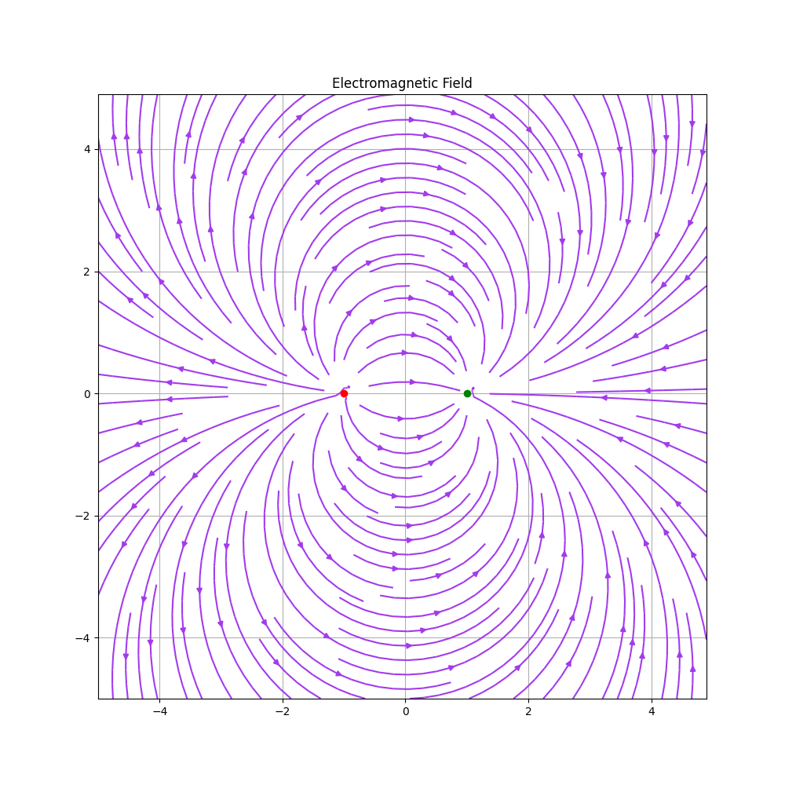

## 附錄: 場線的圖形

場線(field line)可以用來展示電場和磁場，可以用數學的散度
(Divergence)或curl來繪製向量圖

假設每個 $(x, y)$ 座標都對應到 $[u, v]$ 的向量(2D)，可以寫成

\begin{equation}
F =
\begin{cases}
u = f(x, y) \\
v = g(x, y)
\end{cases}
\end{equation}

有些軟體提供quiver來繪製2D向量箭頭

我們可以依據公式畫向量場 (Vector field)的圖形

\begin{equation}
F =
\begin{cases}
u = -y \\
v = x
\end{cases}
\end{equation}

\begin{tikzpicture}
\begin{axis}[
  xmin = -10, xmax = 10,
  ymin = -10, ymax = 10,
  zmin = 0, zmax = 1,
  axis equal image,
  view = {0}{90},
  title = {Electromagnetic Field},
  height=7cm,
  xlabel = {$x$},
  ylabel = {$y$},
  colormap/viridis,
  yticklabels={,,},
  xticklabels={,,},
  point meta
]
\addplot3[
  point meta = {sqrt(x^2+y^2)},
  quiver = {
    u = {-y},
    v = {x},
    scale arrows=1
  },
  quiver/colored = {mapped color},
  -stealth,
  domain = -9:9,
  domain y = -9:9,
] {0};
\end{axis}
\end{tikzpicture} 把箭頭長度縮短 \begin{tikzpicture}
\begin{axis}[
  xmin = -10, xmax = 10,
  ymin = -10, ymax = 10,
  zmin = 0, zmax = 1,
  axis equal image,
  view = {0}{90},
  title = {Electromagnetic Field},
  height=7cm,
  xlabel = {$x$},
  ylabel = {$y$},
  colormap/viridis,
  yticklabels={,,},
  xticklabels={,,},
  point meta
]
\addplot3[
  point meta = {sqrt(x^2+y^2)},
  quiver = {
    u = {-y},
    v = {x},
    scale arrows=0.2
  },
  quiver/colored = {mapped color},
  -stealth,
  domain = -9:9,
  domain y = -9:9,
] {0};
\end{axis}
\end{tikzpicture}

或用固定的箭頭長度，則向量公式變為

\begin{equation}
F =
\begin{cases}
u = \frac{-y}{\hypot(x, y)} \\
v = \frac{x}{\hypot(x, y)}
\end{cases}
\end{equation}

其中 

$$
\hypot(x, y) = \sqrt{x ^ 2 + y ^ 2}
$$

\begin{tikzpicture}
\begin{axis}[
  xmin = -10, xmax = 10,
  ymin = -10, ymax = 10,
  zmin = 0, zmax = 1,
  axis equal image,
  view = {0}{90},
  title = {Electromagnetic Field},
  height=7cm,
  xlabel = {$x$},
  ylabel = {$y$},
  colormap/viridis,
  yticklabels={,,},
  xticklabels={,,},
  point meta
]
\addplot3[
  point meta = {sqrt(x^2+y^2)},
  quiver = {
    u = {-y/sqrt(x^2+y^2)},
    v = {x/sqrt(x^2+y^2)},
    scale arrows = 0.2
  },
  quiver/colored = {mapped color},
  -stealth,
  domain = -9:9,
  domain y = -9:9,
] {0};
\end{axis}
\end{tikzpicture}

用 latex 的 tikz 畫地球的磁場

<https://texample.net/tikz/examples/dipolar-magnetic-field>

\begin{tikzpicture}[scale=1.0,
        %Option for nice arrows%
        >=latex,%
        inner sep=0pt,%
        outer sep=2pt,%
        mark coordinate/.style={outer sep=0pt,
            minimum size=3pt, fill=black,circle}%
    ]
    %% some definitions
    \def\R{0.5}       % sphere radius
    \def\angEl{30}    % elevation angle
    \def\angAz{-140}  % azimuth angle
    \def\angPhi{-105} % longitude of point
    \def\angBeta{55}  % latitude of point
    \def\angGam{-190} % longitude of point
    %% working planes
    \pgfmathsetmacro\H{\R*cos(\angEl)}          % Distance to north pole
    \LongitudePlane[xzplane]{\angEl}{\angAz}    % x-axis plane
    %
    \coordinate (O) at (0,0);
    %
    \begin{scope}[rotate around={-11.1:(0,0)},
        field line/.style={color=red, smooth,
            variable=\t, samples at={0,-5,-10,...,-360}}
    ]
        \clip[rotate around={11.1:(0,0)}] (-7,5) rectangle (7,-5);

        % Computes a point on a field line given r and t
        \newcommand{\fieldlinecurve}[2]{%
            {(pow(#1,2))*(3*cos(#2)+cos(3*#2))}, {(pow(#1,2))*(sin(#2)+sin(3*#2))}%
        }

        % Longitudinal plnaes
        \foreach \u in {0,-40,...,-160}{
            \LongitudePlane[{{\u}zplane}]{\angEl}{\u}
            \foreach \r in {0.25,0.5,...,2.25} {
                \draw[{{\u}zplane}, field line]
                plot (\fieldlinecurve{\r}{\t});
            }
        }
        \foreach \u in {-200,-240,...,-320}{
            \LongitudePlane[{{\u}zplane}]{\angEl}{\u}
            \foreach \r in {0.25,0.5,...,2.25}{
            \draw[{{\u}zplane}, dashed, field line]
                plot (\fieldlinecurve{\r}{\t});
            }
        }
        % Drawing plane for the B-vectors
        \LongitudePlane[bzplane]{\angEl}{0}
            \foreach \r in {0.25,0.5,...,2.25}{
            \draw[bzplane, thick, field line]
                plot (\fieldlinecurve{\r}{\t});
        }

        \begin{scope}[bzplane, very thick, ->, >=stealth]
            \draw (\fieldlinecurve{1.25}{-30}) -- +(-30:0.79cm)  node[right] {$\vec{B_{r}}$};
            \draw (\fieldlinecurve{1.25}{-30}) -- +(60:0.68cm)   node[right] {$\vec{B_{\theta}}$};
            \draw (\fieldlinecurve{1.25}{30})  -- +(-150:0.79cm) node[below] {$\vec{B_{r}}$};
            \draw (\fieldlinecurve{1.25}{30})  -- +(120:0.68cm)  node[above] {$\vec{B_{\theta}}$};
        \end{scope}
        %
        \begin{scope}[rotate around={11.1:(0,0)}]
            \fill[ball color=white,opacity=0.3] (O) circle (\R); %3D lighting effect
            \draw (O) circle (\R);
            \DrawLongitudeCircle[\R]{\angAz}      % xzplane
            \DrawLongitudeCircle[\R]{\angAz + 90} % vzplane
            \DrawLatitudeCircle[\R]{0}            % equator
            \DrawLatitudeCircle[\R]{70}           % Latitude 70
            \DrawLatitudeCircle[\R]{-70}          % Latitude -70
        \end{scope}
        %
        \coordinate[mark coordinate] (Sm) at (0, \H);
        \coordinate[mark coordinate] (Nm) at (0,-\H);
        \path[xzplane] (Nm) -- +(0,-0.75) coordinate (Nm1) node[below] {$\mathbf{N}_m$}
                       (Sm) -- +(0,0.75)  coordinate (Sm1) node[above] {$\mathbf{S}_m$};
        \draw[very thick, dashed]    (Sm) -- (Nm);
        \draw[very thick]            (Sm1) -- (Sm);
        \draw[very thick,->,>=latex'](Nm) -- (Nm1);
    \end{scope}
\end{tikzpicture}

或用一些繪圖工具的 stream plot功能

{width=50%, height=50%}
