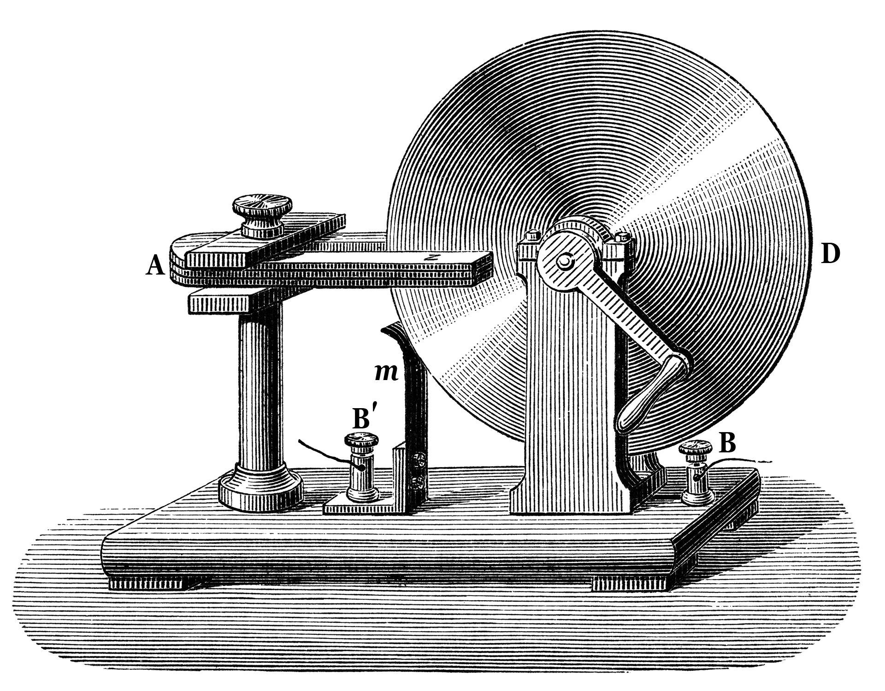

# CH1 - 電工機械基本概念

電工機械(electric machinery)是指「根據電磁感應原理及電磁效應原理，進行發電、變電及用電的機械」，也稱為電機機械，或簡稱電機。

## 電工機械的分類與應用

### 以能量方式區分

1. 發電機(generator, G)
    發電機是把動能(旋轉、機械能)或其它形式的能量轉化成電能的裝置。一般的發電機是通過原動機先將各類一次能源蘊藏的能量轉換為機械能，然後通過發電機轉換為電能，經輸電、配電網路送往各種用電場所。 法拉第圓盤(Faraday disk)是英國科學家法拉利用電磁感應原理發明了歷史上第一部發電機。太陽能發電(Solar power)和傳統發電機構造不同，不用旋轉就可以發電。利用磁場產生電(電磁感應)。
\begin{circuitikz}\draw (0, 0)  to node[elmech]{G} (0, 0);\end{circuitikz}
2. 電動機(Motor, M)
    電動機是把電能轉為動能的裝置(旋轉、機械能)。俗稱「馬達」。利用電產生磁場(電磁效應)。\begin{circuitikz}\draw (0, 0)  to node[elmech]{M} (0, 0);\end{circuitikz}
3. 變壓器(transformer, TR)
    變壓器是把一次側的電壓轉為二次側的電壓的裝置。可能從高電壓轉低電壓，或低電壓轉高電壓。只能用在交流電。美國 \begin{circuitikz}\draw (0, 0) to node[transformer core]{} (0, 0);\end{circuitikz} 可愛版 \begin{circuitikz} \draw (0, 0) to node[transformer core, cute]{} (0, 0); \end{circuitikz}歐洲標準\begin{circuitikz}[european]\draw (0, 0)
  to node[transformer core]{} (0, 0);\end{circuitikz}
 
## 依電源性質區分

1. 直流(direct current, DC)

\begin{tikzpicture}
    \begin{axis}[
        xlabel=$t$,
        ylabel=$v(t)$
    ]
\addplot[color=red, samples=100, domain=0:10]{abs(sin(deg(x)))};
\addlegendentry{pulsed current}
\addplot[color=blue, samples=10, domain=0:10]{0.4};
\addlegendentry{direct current}
\addplot[color=green, samples=100, domain=0:10]{mod(x, 2)/2};
\addlegendentry{triangle}
\addplot[color=yellow, samples=100, domain=0:10]{rnd};
\addlegendentry{variable}
\end{axis}
\end{tikzpicture}

2. 交流(alternating current, AC)

\begin{tikzpicture}
    \begin{axis}[
        xlabel=$t$,
        ylabel=$v(t)$
    ]
    \addplot[color=red, samples=100, domain=0:10]{sin(deg(x))};
    \end{axis}
\end{tikzpicture}

詳見電子學第一單元介紹

## 依機能區分

1. 旋轉電機 - 工作時**會**轉動的電機
2. 靜止電機 - 工作時**不會**轉動的電機

+ 電機
  * 旋轉電機
    + 直流電機
      - 直流發電機(他激、串激、複激、並激)
      - 直流電動機(他激、串激、複激、並激)
      - 特殊直流電機
    + 交流電機
      - 交流發電機
      - 交流電動機(感應機、同步機)
      - 特殊交流電機
  * 靜止電機
    + 變壓器
    + 特殊靜止電機
      - 變流器
      - 磁性放大器

\begin{tikzpicture}

\Tree [.電機 [
  [.旋轉電機 [
      [.直流電機 [
          [.直流發電機 [
           [.\node[draw] (b) {連接方式}; [.他激 ] [.串激 ] [.複激 ] [.並激 ] ]
          ] ]
          [.直流電動機 [.\node[draw](a){連接方式}; ] ]
          [.特殊直流電機 ]
      ] ]
      [.交流電機 [
          [.交流發電機 ]
          [.交流電動機 ]
          [.特殊交流電機 ]
      ] ]
  ]
  ]
  [.靜止電機 [
      [.變壓器 ]
      [.特殊靜止電機 [
          [. 直流電機 ]
          [. 交流電機 ]
      ] ]
  ]
  ]
]
]
\draw  ..controls +(south:1) .. (b);
\end{tikzpicture}

## 基礎電磁理論

麥克斯韋方程組(Maxwell's equations)描述了電場、磁場與電荷密度、電流密度之間的關係

* 磁鐵：具有磁力，可吸引鐵 . 鈷 . 鎳及其部分合金(通稱為磁性物質)，而不會吸引其他材質的製品。
* 磁力：像磁鐵這類的物質所具有互相吸引或排斥的一種超距力。
* 磁極：任何形狀的磁鐵均具有兩個不同且磁力最強的磁性端，分別稱為N極(指向北方的一端或稱指北極)及S極(指向南方的一端或稱指南極)。
* 兩根磁鐵的磁極互相靠近時，同名極會相斥，異名極相吸。
* 磁極無法單獨存在：將磁鐵截斷成兩半或數小段，每段仍然具有N極及S極。
* 磁化：將不具磁性的磁性物質(如鐵.鈷.鎳等靠近磁鐵而暫時具有磁性的現象。
* 暫時磁鐵：像鐵釘這類物質，一旦將吸附的磁鐵移除後，便無法長期保有磁性的物質。
* 永久磁鐵：像鋼釘這類物質，即使將吸附的磁鐵移除後，仍可長期保有磁性的物質。
* 磁力線(Magnetic line of force)：磁鐵周遭的鐵粉受到磁力的吸引，而排列出許多圍繞磁鐵的圓滑曲線，可用來表示磁力作用範圍的假想曲線。
* 以 $\bigodot$ 代表磁力線流出紙面 $\bigotimes$ 代表磁力線流入紙面
* 磁力線的性質：
  1. 磁力線的走向：外部由磁鐵的N極到S極，內部由S極到N極，形成一封閉的曲線。
  2. 磁力線永遠不會相交。
  3. 磁力線愈密集表示該處磁力愈強。
* 磁場(magnetic field)：指磁力所作用的範圍，可以磁力線來表示。
  1. 磁力線愈密處，磁場強度愈強，磁性物質在該處所受到的磁力也愈大。
  2. 在磁鐵周遭擺放許多小磁針，觀察磁針N極的指向，若以圓滑曲線將磁針N極連接，發現所形成的圖形與鐵粉分布曲線極為相似。
  3. 科學上訂定磁針N極的指向為磁力線的切線方向，也就是磁場方向，
    及磁性物質在該處所受到的磁力方向。
* 靜電荷(static charge): 將二物體互相摩擦，會在物體表面產生極性相反的代電粒子，並不會在物體上任意移動，稱為靜電荷
* 弗蘭克林發現摩擦生電會在物體表面產生正電和負電。靜電分為正電和負電。
* 靜電力(electrostatic force): 靜電荷異性相吸、同性相斥的作用力
* 靜電感應(electrostatic induction): 將帶有靜電荷的物體靠近未帶電的導體，則導體表面產生極性相反的靜電荷。用靜電感應讓物體帶電的方法稱為**感應起電**
* 電荷守恆定律: 磨差生電或靜電感應只是移動電荷，電荷的總數目不會改變
* 電場(electric  field): 存在於電荷周圍能傳遞電荷與電荷之間相互作用的物理場。
* 電磁場(electromagnetic field): 移動的電荷會產生電場和磁場，電磁場是電場和磁場的結合。
* 地磁：指地球本身的磁場。磁針若只受到地磁影響，則N極會指向北方(地磁北極)，S極會指向南方(地磁南極)。

* 磁場的定義 - 勞侖茲力(Lorentz force)
* 勞侖茲力: 運動於電磁場的帶電粒子所感受到的作用力
* 勞侖茲力方程式

\begin{equation}
\mathbf{F} = q(\mathbf{E} + \mathbf{v} \times \mathbf{B})
\end{equation}

* $F$: 勞侖茲力
* $q$: 帶電粒子的電荷量
* $E$: 電場強度
* $v$: 帶電粒子的速度
* $B$: 磁通密度

F、E、v、B都是向量

假設檢驗電荷靜止不動($\mathbf{v} = 0$)，則勞侖茲力方程式變為

\begin{equation}
\mathbf{F} = q \mathbf{E}
\end{equation}

或磁場中的磁偶極子感受到的力矩

\begin{equation}
\boldsymbol{\tau } = \boldsymbol{\mu } \times \mathbf{B}
\end{equation}

$\tau$: 力矩($N-M$)

$\mu$: 磁偶極矩($M^2·A$)

* 當帶電粒子運動方向與均勻磁場垂直時,勞倫茲力提供向心力,使帶電粒子作等速率圓周運動，此時勞侖茲力

\begin{equation}
\mathbf{F} = q \mathbf{v} \times \mathbf{B}
\end{equation}

* 磁通量($\phi$)和磁通密度($B$):

\begin{equation}
B = \frac{\phi}{A} (Wb/m^2)
\end{equation}

代號    | B   | $\phi$ | A
---     | --- | ---    | ---
名稱    | 磁通密度     | 磁通量  | 面積
MKS單位 | 韋伯/平方公尺($Wb/m^2$)、特斯拉(Tesla) | 韋伯(Wb) | 平方公尺($m^2$)
CGS單位 | 高斯(Gauss)  | 線，馬克斯威爾(Maxwell) | 平方公分(cm^2)

* 單位互換:

\begin{equation}
\begin{split}
& 1 \mathrm{Wb} = 10^8 \mathrm{Maxwell} \\
& 1 \mathrm{Wb} / m^2 = 1 T (Tesla) = 10^4 \mathrm{Gauss}
\end{split}
\end{equation}

* 磁動勢

\begin{equation}
F = N I (\mathrm{AT})
\end{equation}

* 庫倫磁力定律

不同磁極間有同性相斥、異性相吸的作用

\begin{equation}
F = K \times K_M \frac{m_1 m_2}{r^2} (\mathrm{N})
\end{equation}

$F$: 作用力大小(牛頓，N)
$K$: 當磁極間介質磁導率為 $\mu$ 時

\begin{equation}
K = \frac{1}{4 \pi \mu}
\end{equation}

$r$: 二磁極距離(公尺，m)
$m_1$，$m_2$: 磁通(韋伯，Wb)

* 磁滯損失(Magnetic hysteresis)

磁滯損失是指鐵磁性物理材料，在磁化和去磁過程中，鐵磁質的磁化強度不僅依賴於外磁場強度，還依賴於原先磁化強度的現象。磁滯損失是因為電流正向和反向流動時鐵芯的磁化和退磁引起的，隨著磁力（電流）的增加，磁通量也會增加。當磁力（電流）被移除時，磁通量逐漸減少而不是突然減少。即使磁力為零，磁通密度也保持為正且必須在反向上施加磁力以實現零磁通密度。 

\begin{tikzpicture}
\node [] at (0, 0) {Hysteresis};
\node [draw, blue] at (3, 0) {Hysteresis loss};
\node [draw, red] at (6, 0) {slope};
\begin{axis}[
             samples = 100,
             xlabel = H,
             ylabel = B,
             xmin = -6.5,
             xmax = 6.5,
             ymin = -5,
             ymax = 5,
             axis x line = middle,
             axis y line = middle,
             ticks = none]
    \addplot[dashed, domain=-6:6] plot (\x, 2.5);
    \addplot[dashed, domain=-6:6] plot (\x,-2.5);
    \addplot[blue, thick, domain=-6:6, name path=A] plot (\x, {5/(1 + exp(-1*\x+1.6))-2.5});
    \addplot[blue, thick, domain=-6:6, name path=B] plot (\x, {5/(1 + exp(-1*\x-1.6))-2.5});
    \addplot[blue!10] fill between[of=A and B];
    \addplot[red, domain=-6:6] plot (\x, {x/2.4});
    \filldraw[black] (-6, -2.5) circle (2pt) node[anchor=north] {a};
    \filldraw[black] (6, 2.5) circle (2pt) node[anchor=north] {b};
\end{axis}
\end{tikzpicture}

* a點到b點中的紅線是線行的
* 藍色的區域是磁滯損失，a電和b點為磁滯區線兩周期的極值

* 磁化力(magnetizing force)、磁場強度

\begin{equation}
\begin{split}
H &= \frac{\mathcal{F}}{\ell} \\
  &= \frac{N I}{\ell} \\
  &= \frac{F}{m}
\end{split}
\end{equation}

* $\mathcal{F}$: 磁動勢($A t$，安匝)
* $\ell$: 磁路長度(m, 公尺)
* $N$: 匝數(t)
* $I$: 電流($A$, 安培)
* $m$: 磁極於該點的受力大小(牛頓，N)
* $m$: 磁通(韋伯, Wb)

$\mu$ 為導磁率(magnetic permeability of material)(Henrys/meter)

相對磁導率定義

\begin{equation}
\mu = {\mu}_r \times {\mu}_0
\end{equation}

${\mu}_0$ 為真空磁導率，等於 $4 \pi \times 10^{-7}$

* 長直導線的磁場強度

\begin{equation}
H = \frac{I}{2 \pi d}
\end{equation}

* 螺旋線圈的磁場強度

\begin{equation}
H = \frac{F}{\ell} = \frac{N I}{2 \pi r}
\end{equation}

* 二導線間的作用力
  - 若電流方向相同，二導線互相排斥
  - 否則，二導線互相吸引
* 兩平行載流導體間的磁場
\begin{tikzpicture}
\foreach \x in {1,2,...,7}{
  \draw[-Straight Barb] (0, \x) -- (8, \x);
}
\draw[densely dashed, ultra thick, blue] (7, 3.5) -- (7, 6.5) -- (3, 6.5);
\draw[ultra thick, brown] (3, 6.5) -- (7, 3.5);
\node[draw, thick] at (1.5, 6.5) {Magnetic Field};
\node[] at (4, 6.2) {\large $\theta$};
\node[] at (4.2, 4.9) {\huge $\ell$};
\node[] at (2, 2.4) {\large $F = B I \ell \sin \theta$};
\end{tikzpicture}

\begin{equation}
F = \frac{u I_1 I_2 \ell}{2 \pi d}
\end{equation}

* 受力$F$(向量) 可疊加(向量的加法)

\begin{equation}
\vec{F_T} = \vec{F_1} + \vec{F_2} + \vec{F_3} + \cdots
\end{equation}

* 丹麥科學家厄斯特發現電流會使磁針偏轉，顯示通有電流的導線周圍有磁場存在。
* 電流的磁效應：指電流(或運動中的電荷)會產生磁場的現象。
* 電磁效應(Electromagnetic effect): 「電生磁」
* 安培右手定則(用來判斷磁場和導線方向)
  * 若磁場方向是**右手四指握住導線的方向**，則**拇指方向**為電流方向
  * 若磁場方向是**拇指方向**，**右手四指握住導線的方向**則為電流方向
* 弗萊明左手定則(電動機定則)
  * 食指: 磁場(因)
  * 中指: 電流(因) 
  * 拇指: 運動(果)
* 當運動方向與磁場方向平行時($sin(0) = 0$)，導體受力 $F = 0$
* 載流導體在磁場中的受力大小、電磁力(electromagnetic force)

\begin{equation}
F = B I \ell \sin \theta (N)
\end{equation}

* 電磁感應(electromagnetic induction): 「磁生電」
* 弗萊明右手定則(發電機定則)
  * 食指: 磁場(因) 
  * 中指: 電流(果)
  * 拇指: 運動(因)
* 法拉第電磁感應定律: 
    \begin{equation}
    E = | N \frac{\Delta \phi}{\Delta t} | (\text{V})
    \end{equation}
* 楞次定律: 電磁感應電勢(E)的極性，係反抗原有磁交鏈($N \phi$)的變化。在法拉第電磁感應定律加上負號就是楞次定律，表示感應電勢的極性為抵抗原磁通的方向。
    \begin{equation}
    E = - N \frac{\Delta \phi}{\Delta t} (\text{V})
    \end{equation}
* 長直導體在磁場中的感應電勢

當一根長度為$L$的長直導線，有$q$的電荷，以$v$的速度移動於磁場$B$，此時的勞侖茲力為

\begin{equation}
\mathbf{F}=q\mathbf {v} \times \mathbf {B}
\end{equation}

因為這磁場力的作用，會感應出一個電場 $\mathcal {E}$ 

\begin{equation}
\mathcal {E} = -v \times B
\end{equation}

加入長度 $L$ 得到

\begin{equation}
{\mathcal {E}}=\int _{L}{\frac {\mathbf {F} }{q}}\cdot d{\boldsymbol {\ell }}=vBL
\end{equation}

若加入一電阻R，則流過R的電流為

\begin{equation}
I = \frac{\mathcal{E}}{R}=\frac{vBL}{R}
\end{equation}

\begin{tikzpicture}
\foreach \x in {1,2,...,7}{
  \draw[-Straight Barb] (0, \x) -- (8, \x);
}
\draw[->, ultra thick, brown] (3, 5.5) -- (7, 3.5);
\draw [densely dashed, thick] (3, 5.5) -- (3, 3.5) -- (7, 3.5);
\node[draw, thick] at (1.5, 6.5) {Magnetic Field};
\node[] at (5.5, 3.8) {$\theta = 37^\circ$ };
\node[] at (2.7, 4.4) {3};
\node[] at (4.9, 3.2) {4};
\node[] at (5.2, 4.9) {\large $\ell = 5$};
\node[] at (4, 2.4) {\large $\mathcal {E} = B L V \sin \theta$};
\end{tikzpicture}

\begin{equation}
\begin{split}
\mathcal {E} &=  N \frac{\Delta \phi}{\Delta t} (N = 1, \Delta \phi = B \Delta A) \\
  &= \frac{B \Delta A}{\Delta} t (\Delta A = \Delta s l) \\ 
  &= \frac{B(\Delta s l)}{\Delta t} (v = \frac{\Delta s}{\Delta t}) \\
  &= B L v \sin \theta (V)
\end{split}
\end{equation}

* 當運動方向與磁場方向平行時($sin(0) = 0$)，長直導體感應電勢 $E = 0$
