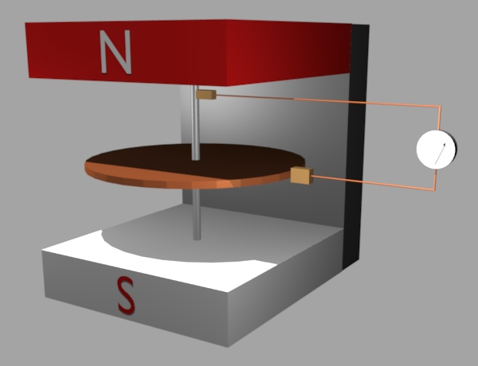
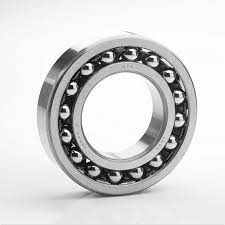
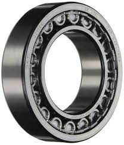
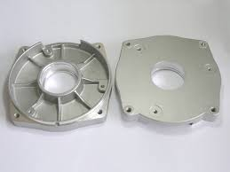

# CH2 - 直流發電機

## 直流發電機之原理

* 弗萊明右手定則 - 判斷感應電勢方向

大拇指(必須先有): F(機械能、動能)
食指(轉換媒介): B(磁能)
中指(才能產生): I(電能)

* 法拉第實驗 - 放置繞有激磁繞組的磁極於左右兩側，將線圈放在中央(電樞)轉子上，當電樞轉動時，電樞上的導體會不斷的切割磁力線而感應電勢

{width=50%, height=50%}

* 一導體繞成長方形線圈稱為一匝(turn)
* Z(導體數) = 2N(匝數) 
* 線圈邊(Coil side): 
* 繞組(Winding): 由一或多雜的線圈組成
* 並聯電流路徑(a): 將電樞並聯，根據 $P = V I$ ，可降低輸出電壓，而獲得較佳的運轉特性
* 電機角(${\theta}_e$)和機械角(${\theta}_m$)

\begin{equation} \label{eq-e-m}
{\theta}_e = \frac{P}{2} {\theta}_m
\end{equation}

當轉子旋轉時，發電機的導體會感應出一個交流正弦波(Alternate sine wave)的電勢，就是**交流發電機**

\begin{tikzpicture}
\begin{axis}[
    axis lines = left,
    xlabel = \(t\),
    ylabel = {\(v(t)\)},
    mark=*]
\addplot[color=red, domain=0:10, samples=100] {sin(deg(x))};
\end{axis}
\end{tikzpicture}

如果加上換向器(整流子)，則輸出波型為一脈動直流(等於交流正弦波的有效值)，就是**直流發電機**，輸出模型如同橋式整流的輸出波型。

\begin{tikzpicture}
\begin{axis}[]
\addplot[domain=0:10, mark=o, samples=100]{abs(sin(deg(x/2)))};
\end{axis}
\end{tikzpicture}

若裝兩顆繞組，兩繞組相隔 $90^\circ$ 配置

可以表示為

\begin{equation}
\begin{split}
\vec{V_{p1}} = \vec{V_p}
\vec{V_{p2}} = \vec{V_p} + 90^\circ
\end{split}
\end{equation}

\begin{tikzpicture}
\begin{axis}[
    axis lines = left,
    xlabel = \(t\),
    ylabel = {\(v(t)\)}]
\addplot[color=red, dotted, domain=0:10, samples=100] {abs(sin(deg(x)))};
\addplot[color=blue, dashed, domain=0:10, samples=100] {abs(sin(deg(x) - 90))};
\addplot[color=black, thick, domain=0:10, samples=100] {abs(sin(deg(x))) + abs(sin(deg(x) - 90))};
\end{axis}
\end{tikzpicture}

若裝了三個繞組(三項電源)，三個繞組相 $120^\circ$ 配置

可以表示為

\begin{equation}
\begin{split}
\vec{V_{p1}} &= \vec{V_p} \\
\vec{V_{p2}} &= \vec{V_p} + 120^\circ \\
\vec{V_{p3}} &= \vec{V_p} - 120^\circ
\end{split}
\end{equation}

\begin{tikzpicture}
\begin{axis}[
    axis lines = left,
    xlabel = \(t\),
    ylabel = {\(v(t)\)}]
\addplot[color=red, dotted, domain=0:10, samples=100] {abs(sin(deg(x)))};
\addplot[color=blue, dashed, domain=0:10, samples=100] {abs(sin(deg(x) - 120))};
\addplot[color=blue, dashed, domain=0:10, samples=100] {abs(sin(deg(x) + 120))};
\addplot[color=black, thick, domain=0:10, samples=100] {abs(sin(deg(x) + 120)) + abs(sin(deg(x))) + abs(sin(deg(x) - 120))};
\end{axis}
\end{tikzpicture}

* 直流發電機的感應電勢

而每一導體通過一個磁極所需要的時間($\triangle t$) 為

\begin{equation}
\triangle t = \frac{1}{n} \times \frac{1}{P} \times 60 = \frac{60}{nP}
\end{equation}

正負電刷間，每一路徑的串聯匝數(N)為

\begin{equation}
N = \frac{Z_T}{a} = \frac{Z}{2a}
\end{equation}

每一繞組經過一個磁極的磁通變化量為 

\begin{equation}
\triangle \phi = \phi - (- \phi) = 2 \phi
\end{equation}

帶入法拉第電磁感應定律 $E = N \frac{\triangle \phi}{\triangle t}$

\begin{equation}
\begin{split}
E &= N \frac{\triangle \phi}{\triangle t} \\
  &= \frac{Z}{2a} \times \frac{2 \phi}{\frac{60}{nP}} \\
  &= \frac{PZ}{60a} \phi n
\end{split}
\end{equation}

$E$: 感應電勢(V)
$n$: 電樞轉速(rpm)
$\phi$: 磁通(Wb)
$Z$: 電樞導體數
$a$: 並聯電流路徑數
$P$: 磁極數

或者當 $P$、$Z$、$a$ 是固定值(如製造成品)，假設常數 $K_E = \frac{PZ}{60a}$，則可以寫為

\begin{equation}
E = K_E \phi n
\end{equation}

得知當 $K_E$ 固定時，感應電勢和**磁通量**($\phi$) 和**轉速**(n)成正比

### 直流機
  1. 採用矽鋼疊製而成(減少窩損失)
  2. 極掌面大於極心(為提高空氣隙之磁通密度)
  3. 極尖易飽和(輔助換向作用)
  4. 相鄰必為異極

### 繞組

特性       | 分激場繞組 | 串激場繞組   | 中間極場繞組 | 補償繞組
--------   | --------   | --------     | --------     | --------
線徑       | 細         | 粗           | 粗           | 粗
匝數       | 多         | 少           | 少           | 少
電阻       | 大         | 小           | 小           | 小

* 中間極繞組: 裝置於兩主磁極中間改善換向
* 補償繞組: 裝置於主磁極的極面槽內抵銷電樞反應

### 電刷

種類           | 特性               | 接觸電阻   | 用途
----           | ----               | ----       | ----
炭質電刷       | 質密而堅硬         | 高         | 低速電機
石磨質電刷     | 質軟而潤滑         | 低         | 高速電機
電化石磨質電刷 | 炭精加熱，加壓而成 | 適中       | 一般DC G/M
金屬石磨質電刷 | 含金屬量 50% ~ 90% | 低         | 大電流電機

* 碳: R大幫助換相，增加機械強度
* 石磨: 潤滑作業
* 鋼: 電流大，導電性佳
* 應具備:
  - 高機械強度
  - 高載流容量
  - 高接觸電阻
  - 有潤滑作用

* 握刷器(Brush holder)的功能是將電刷和換向器表面保持穩定的接觸，原理是用彈簧來保持接觸力。壓力必須適中，過大時可能使電刷跳離換向片表面，過小時使電刷跳動，造成換向不良，產生火花

### 轉子

1. 電磁
  1. 矽鋼: 檢少磁滯損
  2. 疊片: 渦流損
  3. 鐵心開口槽 
    - 開口槽(Open slot): 用於大型或轉速較慢之電機
    - 開口槽(Semi-open slot): 用於小型或高速之電機
  4. 鐵心槽架構: 
    斜形槽，使R變化
    =>減少噪音

### 電樞繞組

繞製: 疊繞、波繞

特性           | 疊繞(Lap winding)  | 波繞(Wave winding)
-----          | -----              | -----
串並聯         | 並聯式繞組     | 串聯式繞組
電機特性       | 大電流 低電壓  | 小電流 高電壓
電流路徑數a    | $mP$ m 為複分數，P為極數 | $2 m$ m 為複分數，和極數無關
換相片距 $Y_C$ | $\pm m$ +: 前進，-: 後退  | $\frac{c \pm m}{P / 2}$ +: 前進，-: 後退
兩線圈邊的換向片距 | 等於分數(m)，在相鄰位置 | 相隔「約為」兩個極距
前節距 $Y_F$   | $Y_B - Y_C$    | $Y_C - Y_B$
後節距 $Y_B$   | $int(\frac{S}{P})$ | $int(\frac{S}{P})$
電刷數         | 等於極數       | 等於極數，或只用兩個
虛設線圈       | 無             | 當 $Y_C$ 非整數時可能有
 節省導線的繞法 | 前進繞         | 後退繞

* 疊繞時，若 $Y_B > Y_F$ 為前進繞，否則為後退繞
* 蛙腿繞的優點:
  1. 不用均壓線
  2. 電流路徑多

### 機殼

機殼(Frame)又稱場軛(Field yoke)

功能:

1. 支撐與保護全部機件
2. 當作磁路的一部分

所以機殼必須兼顧1. 高機械強度 2. 導磁能力，小型電機大多以矽鋼或軟鋼板製成，而中大型電機則笧採用鋼板蜷曲成形，再以螺銓釘合而成

### 換向器

* 以雲母做絕緣
* 在直流發電電機中，將電樞繞組產生的交流電轉成直流電
* 在直流電動機中，將外部提供的直流電轉成交流到電樞繞組，以在不同磁極下能產生同一方向的轉距

### 轉軸

轉軸(Shaft)用來支撐電樞繞組及換向器旋轉部分，並藉以傳導機械功率

### 軸承

軸承(Bearing)用以支撐轉軸，使轉子能自由轉動，分為

1. 套管軸承(Sleeve bearing): {width=20%, height=20%}又名滑動軸承，俗稱合銅。小型電機採用青銅為材質的套管軸承，大型則以巴氏合金製成。以潤滑油為媒介體，使轉軸在套管的油膜中旋轉。 
2. 鋼珠軸承(Ball bearing): {width=20%, height=20%} 又名滾珠軸承。結構上分為外環、鋼珠(轉動體)及內環三部分，使用油脂做潤滑劑，普遍用於小型電機
3. 鋼柱軸承(Roller bearing): {width=20%, height=20%}又名滾柱軸承，將鋼珠軸承的鋼珠換成圓柱形的滾棒而已，適用於承受大型負載

### 末端架

末端架(End bracket)又稱端蓋，用以放置軸承，支撐整個電樞轉子的圓形盤狀物。{width=20%, height=20%}

### 電樞反應

當發電機接上電負載後，會有電樞電流產生，負載愈大時電樞電流會更著愈大。當電樞電流流過電樞導體時產生電樞磁場(電生磁)，此磁場會干擾主磁極的磁場造成，造成主磁極磁場發生偏移、大小發生變化的現象，這些現象通稱為電樞反應(Armature reaction)。

\begin{tikzpicture}
\draw[dashed, thick] (0, 0) -- (0, 3);
\draw[thick] (0, 0) -- (0, -3);
\node [] at (0, -3.2) {$F_A$};
\draw[red, thick, dotted, thick] (-1, -2.9) -- (1, 2.9);
\draw[thick, ->] (0, 0) -- (3, 0);
\node [] at (3.1, 0.5) {$F_M$};
\draw [red, ->, very thick] (0, 0) -- (2.4, -1);
\draw [dotted] (0, -1) -- (2.4, -1) -- (2.4, 0);
\node [thick, ->] at (2.6, -1) {$F_0$};
\draw [<->] (0.5,0.5) arc (90:-15:20pt);

\node [] at (1.5, 0.4) {$90^\circ$};
\end{tikzpicture}

$F_0$: 合成磁動勢
$F_M$: 主磁極磁動勢
$F_A$: 電樞磁動勢
紅色虛線: 新的磁中性面
y軸: 機械中性面(刷軸)

#### 電樞反應的引響

1. 總磁通減少
2. 磁中性面偏移
3. 換向困難

### 電樞磁動勢(電樞總安匝)

電樞磁動勢/電樞總安匝($\vec{F_A}$) 由去磁磁動勢/去磁安匝($\vec{F_D}$)(De-magnetizing)及交磁磁動勢/交磁安匝(Cross-magnetizing)($\vec{F_C}$)相加而成

\begin{equation}
\begin{split}
\label{eq-f-a}
\vec{F_A} &= NI \\
          &= \vec{F_D} + \vec{F_C} \\
          &= \frac{Z}{2} \times \frac{I_A}{a}
\end{split}
\end{equation}

或

\begin{equation}
\vec{F_C} = \vec{F_A} - \vec{F_D}
\end{equation}

#### 去磁磁動勢 $\vec{F_D}$

每極產生去磁的電樞匝數

\begin{equation}
N_{D/P} = \frac{2a}{360} \times \frac{Z}{2} = \frac{a Z}{360}
\end{equation}

流過去磁區域的電樞導體電流

\begin{equation}
I = \frac{I_A}{a}
\end{equation}

每極的去磁動勢

\begin{equation}
F_{D/P} = N_{D/P} \times I = (\frac{2a}{260} \times \frac{Z}{2}) \times \frac{I_A}{a} = \frac{aZ}{360} \times \frac{I_A}{R_A}
\end{equation}

總去磁動勢

\begin{equation}
F_D = F_{D/P} \times P
\end{equation}

加上方向後變成向量 $\vec{F_D}$

#### 交磁磁動勢 $\vec{F_C}$

產生交磁磁動勢的是位於磁極極掌下之電樞導體，其範圍為左右對稱約 $2 \beta$ 的區域，則每極有 $\beta$ 機械角度的電樞導體產生交磁磁動勢

\begin{equation}
\beta = \frac{360}{P} - 2a (\because P(2a + \beta) = 360^\circ)
\end{equation}

流過交磁區域的電樞導體電流

\begin{equation}
I_{C/P}= \frac{I_A}{a}
\end{equation}

每極交磁磁動勢

\begin{equation}
F_{C/P} = N_{C/P} \times I = \frac{\beta Z}{720} \times \frac{I_A}{a}
\end{equation}

總交磁磁動勢

\begin{equation}
F_C = P \times F_{C/P}
\end{equation}

#### 去磁動勢占總電樞磁動勢的

\begin{equation}
\label{eq-f-d}
F_D = F_A \times \frac{4 \theta_e}{360} = F_A \times \frac{2\theta_e}{180}
\end{equation}

#### 交磁動勢占總電樞磁動勢的

根據 \eqref{eq-f-d}

\begin{equation}
F_C = F_A \times \frac{180 - 2 \theta_e}{180}
\end{equation}

或用  \eqref{eq-f-a}

\begin{equation}
\vec{F_C} = \vec{F_A} - \vec{F_D}
\end{equation}

#### 範例: 台電-電工機械- 108 年試題

> 某**4極**直流發電機，電樞總導體數為144根，繞線方式採**單分疊繞**，其電樞電流為120A，其電刷前移20度電機角，則此發電機之**總去磁安匝**為多少?

答: 480 安匝
解:

1. **電流路徑數** $a = mp = 4 \times 1 = 4$ (疊繞、單分、4極)
2. **電樞總安匝** $F_A$

\begin{equation}
\begin{split}
F_A &= NI \\
    &= \frac{Z}{2} \times \frac{I_A}{a} \\
    &= \frac{144}{2} \times \frac{120}{4} \\
    &= 72 \times 30 \\
    &= 2160 (At)
\end{split}
\end{equation}

3. 根據\eqref{eq-e-m}得到電機角

\begin{equation}
\theta_e = \frac{P}{2} \times \theta_m = 40^\circ
\end{equation}

4. 用 \eqref{eq-f-d} 得到**總去磁安匝**

\begin{equation}
\begin{split}
F_D &= F_A \times \frac{2\theta_e}{180} \\
    &= 2160 \times \frac{40}{180} \\
    &= 480 (At)
\end{split}
\end{equation}

## 改善電樞反應

1. 改良主磁極的結構
  1. 使用削角極尖: 將極掌和電樞面設計為非同心圓，增加極尖的磁阻，如此刻意制電樞反應對極尖的引響
  2. 採用交錯極尖: 以缺左尖和缺右尖的矽鋼片交錯疊成，使極尖的磁路面積降低，磁阻增大，磁通易於飽和，抑制電樞反應。
  3. 採用楞德爾磁極(Lundall pole): 在主磁極的極心刻出長槽，用以增加電樞磁通穿越時的磁阻，抑制電樞反應。
2. 增加主磁極的極數
  在不引響改應電勢或轉矩之下，增加主磁極的極數，相對的可以減少電樞導體數，藉以減少電樞反應引起的磁動勢。
3. 增設補償繞組
  補償繞組勢在主磁極極面內增設繞組，並與電樞繞組組成反向串聯連接。補償繞組的電流方向和電樞繞組相反，用以產生抵銷部分電樞磁動勢，減少電樞反應。
4. 增加中間極(Inter-pole)
  與電樞繞組串聯，發電機用 **NnSS** 的順序，電動機為 **NnSs**。
  可改善電樞反應和改善換向

### 換向曲線

\begin{tikzpicture}
\begin{axis}[domain=-5:5,samples=100,yticklabels=\empty, xticklabels=\empty]
\addplot[blue] {-x};
\addlegendentry{直線換向}
\addplot[red] {sin(deg(x/3)) * -5};
\addlegendentry{正弦波換向}
\addplot[no markers, green, smooth] coordinates {
    (-5, 5)  (-3, 4.2) (5, -5)
};
\addlegendentry{欠速換向}
\addplot[no markers, brown, smooth] coordinates {
    (-5, 5)  (3, -4.2) (5, -5)
};
\addlegendentry{過速換向}
\end{axis}
\end{tikzpicture}

1. 直線換向(電阻性): 最裡想的換向，不會產生火花
2. 正弦波換向: 小火花
3. 欠速換向: 後刷邊產生大火花
4. 過速換向: 前刷邊大火花

### 改善換向作用

1. 裝設補償繞組
2. 裝置中間極(換向磁極)
3. 減少附載的電感量
3. 提高電刷的接觸電阻
4. 移動電刷法(較困難)

### 直流發電機的等效電路

\begin{tikzpicture}
[
   level distance=18mm,
   every node/.style={fill=red!50,inner sep=5pt},
   level 1/.style={sibling distance=30mm,nodes={fill=yellow!45}},
   level 2/.style={sibling distance=15mm,nodes={fill=red!20}},
   level 3/.style={sibling distance=35mm,nodes={fill=blue!30}},
   level 4/.style={sibling distance=20mm,nodes={fill=green!20}}
]
\tikzstyle{every node}=[font=\small]
  \node[draw] {直流發電機}
    child {node[draw] {他(外)激式}}
    child {node[draw] {自激式} 
                child {node[draw] {他激式}}
                child {node[draw] {串激式}}
                child {node[draw] {分激式}}
                child {node[draw] {複激式}
            child {node[draw] {依連接方式}
                    child {node[draw] {長並聯式}}
                child {node[draw] {短並聯式}}
            }
                    child {node[draw] {依磁通方向}
                child {node[draw] {激複激式}}
                child {node[draw] {差複激式}}
            }
           }
       }
        ;
\end{tikzpicture}

#### 他(外)激式

\begin{circuitikz}
\draw (0, 0)
  to [open, v=$V_F$] (0, 3)
  to [short, i=$I_F$] (1.5, 3);
\draw (0, 0)
  to [short] (1.5, 0)
  to [inductor=$R_F$, cute] (1.5, 3);

\node[elmech] at (2.5, 1.5) (M) {G};
\node[elmech] at (2.5, 1.5) (M) {G};
\node[] at (3.5, 1.5) {$I_A R_A$};
\draw[] (M.north) 
  to [short](2.5, 3)
  to [short, i=$I_L$](5, 3)
  to [R=$R_L$](5, 0)
  to [short] (2.5, 0)
  to [short] (M.south);
\draw (4.5, 0)
  to [open, v<=$V_L$, o-o](4.5, 3);
\end{circuitikz}

\begin{equation}
\begin{split}
&V_L = E_A - I_A R_A - V_B \\
&I_F = \frac{V_F}{R_F} \\
&I_L = \frac{V_L}{R_L} \\
&I_A = I_L
\end{split}
\end{equation}

#### 分(並)激式

\begin{circuitikz}
\draw (2.5, 0)
  to [short] (1.5, 0)
  to [inductor=$R_F$, cute] (1.5, 3)
  to [short](2.5, 3);
\node[elmech] at (2.5, 1.5) (M) {G};
\node[] at (3.5, 1.5) {$I_A R_A$};
\node[] at (3, 2.4) {$V_B$};
\draw[] (M.north) 
  to [short](2.5, 3)
  to [short, i=$I_L$, *-](5, 3)
  to [R=$R_L$](5, 0)
  to [short, -*] (2.5, 0)
  to [short] (M.south);
\draw (4.5, 0)
  to [open, v<=$V_L$, o-o](4.5, 3);
\end{circuitikz}

\begin{equation}
\begin{split}
V_L &= E_A - I_A R_A - V_B \\
I_A &= I_F + I_L \\
I_F &= \frac{V_L}{R_F} \\
I_L &= \frac{V_L}{R_L}
\end{split}
\end{equation}

#### 串激式

\begin{circuitikz}
\node[elmech] at (2.5, 1.5) (M) {G};
\node[] at (3.5, 1.5) {$I_A R_A$};
\node[] at (3, 2.4) {$V_B$};
\draw[] (M.north) 
  to [short](2.5, 3)
  to [short, i=$I_L$, *-](5, 3)
  to [R=$R_L$](5, 0)
  to [inductor=$R_S$, cute, -*, i=$I_F$] (2.5, 0)
  to [short, i=$I_A$] (M.south);
\draw (4.5, 0)
  to [open, v<=$V_L$, o-o](4.5, 3);
\end{circuitikz}

\begin{equation}
\begin{split}
V_L &= E_A - I_A(R_A + R_S) - V_B \\
I_A &= I_F = I_L = \frac{V_L}{R_L}
\end{split}
\end{equation}

#### 短並聯複激式

\begin{circuitikz}
\node[elmech] at (2.5, 1.5) (M) {G};
\node[] at (3.5, 1.5) {$I_A R_A$};
\node[] at (3, 2.4) {$V_B$};
\draw (2.5, 0)
  to [short] (1.5, 0)
  to [inductor=$R_F$, cute, i=$I_F$] (1.5, 3)
  to [short](2.5, 3);
\draw (0.5, 0)
  to[open, v<=$V_F$] (0.5, 3);
\draw[] (M.north) 
  to [short](2.5, 3)
  to [short, i=$I_L$, *-](5, 3)
  to [R=$R_L$](5, 0)
  to [inductor=$R_S$, cute, -*, i=$I_F$] (2.5, 0)
  to [short, i=$I_A$] (M.south);
\draw (4.5, 0)
  to [open, v<=$V_L$, o-o](4.5, 3);
\end{circuitikz}

\begin{equation}
\begin{split}
V_L &= E_A - I_A R_A - V_B - I_S R_S = V_F - I_S R_S \\
I_S &= I_L \\
I_F &= \frac{V_F}{R_F} \\
I_L &= \frac{V_L}{R_L} \\
I_A &= I_F + I_L  = I_F + I_S
\end{split}
\end{equation}

#### 長並聯複激式

\begin{circuitikz}
\node[elmech] at (1.2, 1.5) (M) {G};
\node[] at (0.7, 2) {$I_A R_A$};
\node[] at (0.5, 1.2) {$V_B$};
\draw (3, 0)
  to [short] (3, 0)
  to [inductor=$R_F$, cute, i<=$I_S$] (3, 3)
  to [short](2.5, 3);

\draw[] (M.north) 
  to [short](1.2, 3)

  to [short](5, 3)
  to [R=$R_L$, i=$I_L$](5, 0)  
  to [short] (3, 0)
  to [inductor=$R_S$, cute, i=$I_F$, -*] (1.2, 0)
  to [short, i=$I_A$] (M.south);
\draw (4.5, 0)
  to [open, v<=$V_L$, o-o](4.5, 3);
\end{circuitikz}

\begin{equation}
\begin{split}
V_L &= E_A - I_A R_A - V_B - I_S R_S = V_F \\
I_S &= I_A \\
I_F &= \frac{V_F}{R_F} \\
I_L &= \frac{V_L}{R_L} \\
I_A &= I_F + I_L  = I_F + I_S
\end{split}
\end{equation}

### 直流發電機的特性曲線

曲線名稱           | x軸   | Y軸   | 固定條件(控制變數)      | 調整項目(自變數)
----               | ----  | ----  | ----                    | ----
無載(磁化)特性曲線 | $I_F$ | $E_A$ | 無負載、轉速(n)         | 磁場電流 $I_F$
負載(外部)特性曲線 | $I_L$ | $V_L$ | 轉速(n)、磁場電流 $I_F$ | 負載電流 $I_L$
內部特性曲線       | $I_A$ | $E_A$ | 轉速(n)、磁場電流 $I_F$ | 負載電流 $I_L$
電樞特性曲線       | $I_F$ | $I_A$ | 轉速(n)、端電壓 $V_L$   | 負載電流 $I_L$

無載特性曲線繪出的曲線稱為無載飽和曲線

### 他(外)式發電機的特性曲線

* 無載特性曲線: 與鐵心的磁化曲線相似
* 外部特性曲線: 端電壓 $V_L$ 隨著負載電流 $I_L$ 增加減少

\begin{tikzpicture}
\draw[blue, densely dashed] (0, 3) --(4, 3);
\draw[thick, red] (0, 3) .. controls (2.7,2.8) and (2.7, 2.8).. (4,2.5);
\draw[] (0, 5) -- (0, 0) -- (5, 0);
\node[] at (-0.5, 3) {$E$};
\node[] at (3, -0.5) {$I_L$};
\end{tikzpicture}

* 他激式的特性
  - 激磁電流獨立供電，不受電樞及負載引響
  - 改變激磁電流 $I_F$ 的極性可以控制 $\phi_F$ 方向，改變感應電勢 $E$ 的極性
  - 輸出電壓變動小，可視為定電壓的直流發電機
  - 用途: 當作激磁機、華德黎翁納德系統等需要穩定電壓的直流源

### 分(並)機式發電機的特性曲線

* 外部特性曲線: 

- 負載電流 $I_L$ 有先升後降的特性: 當負載持續增加時，負載電阻 $R_L$ 下降、負載電流 $I_L$ 上升、與之並聯的 $I_F$ 因於下降($I_A = I_F + I_L$)、所產升磁通減少、感應電勢 $E$ 下降，連鎖反應的結果是出現**崩潰點**(Break-down point)，造成 $V_L$ 急劇下降為零，同時 $I_L$ 因而下降。
- 具有短路自我保護的特性: 當輸出短路時，使 $V_L = 0$，則 $V_F = 0$，$I_F = 0$，不會產升磁通，只有剩磁，使 $I_L$ 自動下降，使負載不會燒毀。
- 用途: 一般直流電源、蓄電磁用發電機、交流發電機之機磁機。

* 負載增加: 當並聯愈多負載，因 $R_L = R_{L1} \mathbin{\!/\mkern-5mu/\!} R_{L2}$ 而使負載總電阻減少，而負載電流因 $I = \frac{V}{R}$ 並聯而愈多，功率愈大 ($P = \frac{V^2}{R}$)
* 臨界磁場電阻 $R_Fc$：能建立電壓的最大廠電阻，即為與無載飽和曲線相切之場電阻線。
* 臨界轉速$N_c$：能建立電壓的最低轉速，即為與場電阻線相切之轉速。
* 電機建立電壓的條件:
  1. 須有剩磁。
  2. 剩磁與場磁通的方向要一致。
  3. 磁場電阻 $R_F$ 須小於臨界磁場電阻 $R_Fc$
  4. 轉速N須大於臨界轉速 $N_c$

\begin{tikzpicture}
\draw[blue, densely dashed] (0, 3) --(4, 3);
\draw[thick, red] (0, 3) .. controls (3.5,2.5) and (3.5, 2.5).. (2,0);
\draw[] (0, 5) -- (0, 0) -- (5, 0);
\node[] at (-0.5, 3) {$V_L$};
\node[] at (3, -0.5) {$I_L$};
\end{tikzpicture}

### 串激式發電機的特性曲線

* 無載特性曲線: 串激式發電機在無載時，因與負載串聯，所以呈現斷路，$I_F = I_A = I_L = 0$，沒有無載特性曲線
* 外部特性曲線: 

接上負載後，$I_A$、$I_L$、$I_F$ 增加，主磁極磁通增加，感應電勢 $E$ 增加，輸出端電壓 $V_L$ 隨著負載電流 $I_L$ 增加而上升，為原點到 $o$ 點，適合做 **升壓機** (Blooster)

過了 $a$ 後，因磁飽和現象，磁通不再增加，因電樞反應的去磁動勢甚大，使 $V_L$ 急速下降為零，而 $I_L$ 可視為定值，下降具有恆流效果，可作為弧光燈之電源。

\begin{tikzpicture}
\draw[thick, red] (0,0) .. controls (2.7,5) and (4, 4.9).. (4,0);
\draw[fill=black] (3, 3.7) circle (2pt); 
\node[] at (3, 4) {a};
\draw[] (0, 5) -- (0, 0) -- (5, 0);
\node[] at (-0.5, 3) {$V_L$};
\node[] at (3, -0.5) {$I_L$};
\end{tikzpicture}

### 複激式發電機的特性曲線

* 積(和)複激式: $\phi_S$ 和 $\phi_F$ 的方向**相同**

\begin{equation}
\phi_T = \phi_F + \phi_S
\end{equation}

* 差複激式: $\phi_S$ 和 $\phi_F$ 的方向**相反**

\begin{equation}
\phi_T = \phi_F - \phi_S
\end{equation}

* 分激場繞組產升的 $\phi_F$ 為主要磁通，串激場繞組產生的 $\phi_S$ 用於補償電樞電阻及電樞反應產生的壓降，以維持輸出電壓的穩定。所以串激場繞組與複載串聯，磁通 $\phi_S$ 大小隨附載電流 $I_L$ 而變動，且其值小於分激場磁通 $\phi_F$。串激場繞組採用粗而少的導線繞製而成

藉由在串激場繞組上並聯分流電阻器 $R_X$，調整 $R_X$ 的大小，藉著**串激場繞組產生的感應電勢**和**電樞電阻及電樞反應產生的壓降**比較可分為

類型    | $V_S$ | $V_FL$ 和 $V_NL$ 比較 | 電壓調整率 $\mathcal {E}$
---     | ---   | ---                   | ---
過複激  | 大    | $V_{FL} > V_{NL}$    | 小於零(負值)
平複激  | 中    | $V_{FL} = V_{NL}$    | 零
欠複激  | 小    | $V_{FL} < V_{NL}$    | 大於零(正值)

\begin{tikzpicture}
\draw (0, 0) -- (0, 5);
\draw (0, 0) -- (5, 0);
\draw[thick, red] (0, 4) .. controls (3, 4.8) and (3, 4.8) .. (5, 5);
\draw [dotted, gray] (3.2, 0) -- (3.2, 5);
\draw [dotted, gray] (0, 4) -- (5, 4);
\draw[thick, blue] (0, 4) .. controls (2.4, 4.3) and (2.4, 4.3) .. (5, 3.4);
\draw[thick, green] (0, 4) .. controls (3, 3.7) and (3, 3.7) .. (5, 3);
\draw[thick, magenta] (0, 4) .. controls (3, 3) and (3, 3) .. (5, 2);
\draw[thick, yellow] (0, 4) .. controls (3, 2.5) and (3, 2.5) .. (4, 1);
\draw[thick, cyan] (0, 0) .. controls (4, 5) and (4, 5) .. (5, 3);
\node[red] at (4, 0.4) {過複激};
\node[blue] at (4, 0.8) {平複激};
\node[green] at (4, 1.2) {欠複激};
\node[magenta] at (4, 1.6) {分激};
\node[yellow] at (4, 2) {差複激};
\node[cyan] at (4, 2.4) {串激};
\end{tikzpicture}

* 紅色: 過複激
* 深藍色: 平複激
* 綠色: 欠複激
* 紫色: 分激
* 黃色: 差複激
* 淺藍色: 串激

* 複激式發電機的用途:

類型  | 用途
---------   | ---------
過複激式 | 礦坑或電車
平復激式 | 一般直流電源或中小型直流激用激磁機
欠複激式 | 
差複激式 | 

### 電壓調整率

\begin{equation}
\mathcal {E} \% = VR \% = \frac{V_{FL} - V_{NL}}{V_FL} \times 100\%
\end{equation}

* 電壓調整率為正: $V_{FL} > F_{NL}$ 如他激、分激，欠複激式、差複激式
* 電壓調整率為負: 如平複激式
* 電壓調整率為零: $V_{FL} < V_{NL}$ 如串複激式、過複激式

### 直流發電機的並聯運用

優點:

1. 提高運轉效率
2. 突破單機容量限制
3. 增加供電穩定性
4. 減少備用發電機容量 

條件:

1. 額定端電壓需相等，極性須相同
2. 具備相同的外部(負載)特性
3. 如果是過複激式，需加裝均壓線

電壓關係式

\begin{equation}
V_L = V_1 = V_2
\end{equation}

### 直流電機(發電機、電動機的耗損)及效率

\begin{tikzpicture}[scale=0.8]
\tikzset{edge from parent/.style=
{draw,
edge from parent path={(\tikzparentnode.south)
-- +(0,-8pt)
-| (\tikzchildnode)}}}
\Tree [.直流電動機損失
    [.選轉損 [
      [.機械損 [
        [.軸承摩擦損 ]
        [.電刷摩擦損 ]
        [.風阻損 ]
        [.其他 ]
      ] ]
      [.鐵損 [
          [.磁滯損 ]
          [.渦流損 ]
      ] 
      ]
    ] ]
    [.銅損 [
         [.電樞銅損 ]
         [.分激場銅損 ]
         [.串激場銅損 ]
         [.電刷接觸損失 ]
         [.中間極銅損 ]
         [.補償繞組銅損 ]
    ]
    ]
    [.雜散負載損 ]
]

\end{tikzpicture}

#### 機械損失

有軸承摩擦損、電刷摩擦損、風阻損等，可由實驗得之。

### 鐵損(Core-loss)

1. 磁滯損

鐵心磁分子互相摩擦，因磁滯現象所引起的損失。

\begin{equation}
P_H \propto {B_M}^x f G
\end{equation}

* $G$: 鐵心重量
* $B_M$: 最大磁通密度
* $f$: 頻率
* $X$: 鐵心材料常數，通常假設為2

2. 渦流損

渦流(eddy current)在鐵心引起的損失

\begin{equation}
P_E \propto B_{M}^2 f^2 G t^2
\end{equation}

* 鐵心採用絕緣薄鋼片疊成，可以減少渦流損
* 磁滯損和頻率成正比，渦流損頻率平方成正比
* 頻率是指電樞電流的交流頻率，和轉速成正比

#### 銅損

根據

\begin{equation*}
P = I ^ 2 R
\end{enuation*}

該繞組的銅損和流過該繞組的電流成平方正比，除了**分激、他激場繞組銅損**較不受影響外(視為固定值)，**電樞繞組銅損**和電樞電流成平方正比，其他皆視為和**負載電流成平方正比**。

#### 雜散負載損

由負載電流引起，無法分別或計算其值，一般而言，雜散負載損以滿載輸出的 $1 \%$ 計算

* 固定損: 鐵損、機械損、分激場繞組銅損、他激場繞組銅損
* 變動損: 旋轉損、其他銅損

#### 直流發電機的功率計算

定義效率(Efficiency)為

\begin{equation}
\eta = \frac{\text{輸入功率}}{\text{輸出功率}} = \frac{P_o}{P_i} = \frac{P_o}{P_o + P_{loss}} \times 100 \%
\end{equation}

全日效率

\begin{equation}
\text{全日效率} = \frac{\text{全日輸出總能量}}{\text{全日輸入總能量} + \text{全日固定損失} + \text{全日變動損失}} \times 100 \%
\end{equation}

