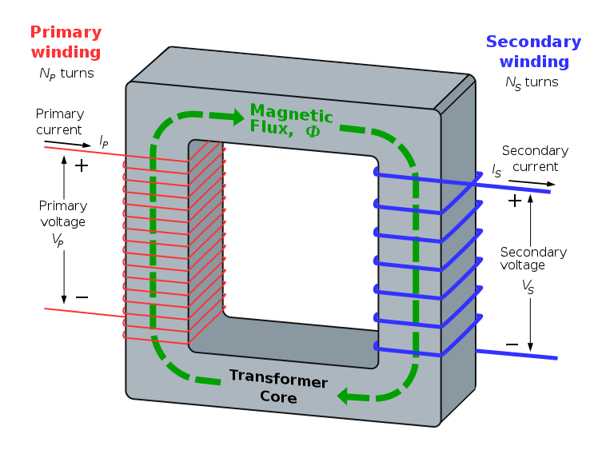

# CH 4 - 變壓器

## 變壓器的基本原理

變壓器(Transformer)是一種把交流電壓升高或降低的裝置，變壓器屬於靜止電機，不像發電機和電動機會轉動，而是利用「電生磁」在一次側的電能產生磁通，傳遞到二次側，並利用「磁生電」在二次側感應出電能，使電能在變壓器裡傳遞，改變兩端的電壓。

變壓器的組成

* 一次繞組(Primary winding): 連接交流電源(輸入)
* 二次繞組(Secondary winding): 連接負載(輸出)。當沒接負載時，二次測電流為零，如同開路。
* 鐵心: 支撐線圈，並讓一次繞組的磁通能順利交鏈到二次繞組

* 漏磁通(Leakage flux): 沒有傳遞到另一繞組的磁通，如 $\phi_{11}$ 的。漏磁通會使功率因數降低，電壓調整率降低。為了簡少漏磁通，變壓器的一、二次測繞組距離愈短愈好。因此變壓器的變壓器的一、二次測繞組通常分成若干小繞組，交互疊製而成。然而，漏磁通可以限制短路電流，所以霓虹燈、日光燈、電焊用變壓器皆採用高漏磁變壓器。

在理想的變壓器裡，一次側和二次側的感應電勢和各側的匝數成正比，即

\begin{equation*}
\frac{N1}{N2} = \frac{E_1}{E_2} \because E = N \frac{\triangle \phi}{\triangle t}
\end{equation*}

因為理想的變壓器鐵心無磁阻、磁滯損失、渦流損失，線圈阻抗為零，所以各
側端電壓等於感應各測的電勢

\begin{equation*}
\frac{N1}{N2} = \frac{E_1}{E_2} = \frac{V_1}{V_2} \because V_1 = E_1, V_2 = E_2
\end{equation*}

在理想的變壓器裡，一次側傳遞的電能全部都到二次側(磁通完全耦合無漏磁)，即

\begin{equation*}
\text{變壓器傳遞的功率} P = I_1 V_1 = I_2 V_2 \because P = V I
\end{equation*}

等式兩邊同除以 $I_1$，得

\begin{equation*}
V_1 = \frac{I_2}{I_1} V_2
\end{equation*}

再除以 $V_2$ 得

\begin{equation*}
\frac{V_1}{V_2} = \frac{I_2}{I_1}
\end{equation*}

由於 $P = \frac{V^2}{R}$，$R = \frac{V^2}{P}$ ，而V和匝數成正比，$V^2$ 和匝數成平方正比，所以各次測電阻和匝數成平方正比，即

\begin{equation*}
\begin{split}
& \frac{N_1}{N_2} = \sqrt{\frac{R_1}{R_2}} \\
& (\frac{N_1}{N_2})^2 = \frac{R_1}{R_2}
\end{split}
\end{equation*}

由電感的定義(材料、外在因數)

\begin{equation}
L = \frac{N^2 \mu A}{\ell}
\end{equation}

可知電感量和匝數成正比

則可以定義變壓器的匝數比常數 $a$ :

\begin{equation}
a = \frac{N_1}{N_2} = \frac{E_1}{E_2} = \frac{I_2}{I_1} = \sqrt{\frac{R_1}{R_2}} = \sqrt{\frac{L_1}{L_2}}
\end{equation}

* 變壓器的感應電勢

從冷次定律，設 $\phi_m$ 為磁通 $\phi$ 的最大值

\begin{equation}
\begin{split}
\text{感應電勢} E &= - N \frac{\Delta \phi}{\Delta t} \\
                  &= -N \frac{2 \phi_m}{T / 2} \\
                  &= -N \frac{2 \phi_m}{1 / 2f} \\
                  &= -4fN\phi_m (\text{V, 伏特})
\end{split}
\end{equation}

因磁通為正弦波，帶入正弦波的波形因數 $FF = \frac{\text{有效值}}{\text{平均值}} = 1.11$

\begin{equation}
E = -4.44 f N \phi_m
\end{equation}

負號表示感應電勢方向和磁通相反，相位差 $180\circ$

或者用電感、電流和時間計算

\begin{equation*}
\begin{split}
\text{感應電勢} E &= - N \frac{\Delta \phi}{\Delta t} \\
  &= -\frac{I}{\Delta t} (N \frac{\Delta \phi}{I}) \text{帶入電感公式} L = \frac{N \phi}{I} \\
  &= -L \frac{\Delta I}{\Delta t} (\text{V, 伏特})
\end{split}
\end{equation*}

\begin{tikzpicture}
\begin{axis}[yticklabels=\empty, xticklabels=\empty,
    xlabel = $t$,
    ylabel = $\phi$]
\addplot[domain=0:7] {0};
\addplot[blue, thick, domain=0:7, samples=50] {sin(deg(x))};
\addlegendentry{$\phi(t) = \phi_m sin(\omega t)$};
\draw[red] (1.6, 0) -- (1.6, 2);
\draw[gray, dashed] (1.6, 0) -- (1.6, -2);
\draw[red] (4.7, 0) -- (4.7, -2);
\draw (1.6, 0) circle (1pt) node[above] {$a$};
\draw (4.7, 0) circle (1pt) node[above] {$b$};
\draw[<->] (1.6, -0.3) -- (4.7, -0.3);
\node[] at (2.2, -0.5) {$T/2$};
\node[red] at (1.8, 0.5) {$\phi_m$};
\node[red] at (5, -0.5) {$\phi_m$};
\end{axis}
\end{tikzpicture}

### 鐵損和磁化電流

當變壓器二次測沒有接沒有負載時，一次測產生的電流(微小)，叫**激磁電流** (exciting current)(這裡用 $I_{ex}$ 來表示)或**無載電流**(這裡用 $I_0$ 來表示)

磁化電流來會產生磁通，屬於電感性，屬於激磁電流的虛部，而鐵損電流屬於電阻性，屬於激磁電流複數的實部。

\begin{equation}
\vec{I_ex} = \vec{I_0} = I_e + \jmath \vec{I_m} = | \vec{I_0} | (\cos \theta_0 + \jmath \sin \theta_0)
\end{equation}

* $\vec{I_0}$: 激磁電流
* $I_e$: 鐵損電流
* $I_m$: 磁化電流
* $\theta_0$: 無載功率因數角
* 以箭頭代表向量，沒箭頭代表純量

加上負載後一次測電流 $I_1$ 等於無載電流 $I_0$ 加一次側負載電流 $I_{L1}$

\begin{equation}
\text{一次測電流} \vec{I_1} = \text{無載電流} \vec{I_0} + \text{一次側負載電流} \vec{I_{L1}}
\end{equation}

## 變壓器的向量圖

* 先備觀念: 電感的電壓超前電流相位90度
* 磁化電流 $I_m$ 和磁通同相
* 一次側負載電流 $I_{L1}$ 和二次測電流 $I_1$ 反相
* $\text{一次測電流} \vec{I_1} = \text{無載電流} \vec{I_0} + \text{一次側負載電流} \vec{I_{L1}}$
* 鐵損電流 $I_e$ 和 $- \vec{E_1}$ 同相(電阻性)
* $\text{積磁電流} I_{ex} = \text{無載電流} \vec{I_0} = \text{鐵損電流} I_e + \jmath \text{磁化電流} I_m$
* $-\vec{E_1}$ 落後/超前 $\vec{E_1}$ 180度(反相)
* 一次測和二次側感應電勢同相
* 磁化電流 $I_m$ 超前一次和二次側感應電勢 $\vec{E_1}$、$\vec{E_2}$ 落後 $90^\circ$ (電感性)
* 一次測電流 $\vec{I_1}$ 落後一次測端電壓 $\vec{V_1}$ $\theta_1$ 度
* 二次測電流 $\vec{I_2}$ 落後二次測端電壓 $\vec{V_2}$ $\theta_2$ 度 (假設二次側接電感性負載)

\begin{tikzpicture}
\node[draw] at (-1, -3) {變壓器的向量圖};
\draw [purple, >-Stealth, thick] (0, 0) -- (canvas polar cs:radius=6cm,angle=0) node[right] {$\vec{E_2} = \vec{E_1}$};
\draw [purple, >-Stealth, thick] (0, 0) -- (canvas polar cs:radius=6cm,angle=180) node[left] {$-\vec{E_2}$}; 
\draw [purple, >-Stealth] (0, 0) -- (canvas polar cs:radius=5cm, angle=90) node[right] {$\phi$} ;
\draw[thin, blue, <-> /.tip = Stealth, <->] (-0.5, 2.2) arc (90:180:2);
\node[black] at (-1.9, 1.2) {$90^\circ$};
\draw[thin, blue, <-> /.tip = Stealth, <->] (2.3, 0.2) arc (0:90:2);
\node[black] at (2.3, 1.4) {$90^\circ$};
\draw[thin, blue, <-> /.tip = Stealth, <->] (1.9, -0.5) arc (-15:-50:2);
\node[blue] at (2.3, -1.4) {$\theta_2$};
\draw[thin, blue, <-> /.tip = Stealth, <->] (-2, 2.2) arc (122:190:2.5);
\node[black] at (-3, 1.7) {$\theta_1$};
\node[black] at (2.3, -1.4) {$\theta_2$};
\draw [green, >-Stealth] (0, 0) -- (canvas polar cs:radius=4cm, angle=130) node[above] {$\vec{I_{L1}}$};
\draw [red, >-Stealth] (0, 0) -- (canvas polar cs:radius=5cm, angle=122) node[above] {$\vec{I_1} = \vec{I_{L1}} + \vec{I_0}$};
\node[green] at (2, -3) {$\vec{I_2}$};
\draw [green, >-Stealth] (0, 0) -- (canvas polar cs:radius=5cm, angle=-50);
\draw [black, >-Stealth, thick] (0, 0) -- (canvas polar cs:radius=5cm, angle=-15) node[right] {$\vec{V_2}$};
\draw [black, >-Stealth, thick] (0, 0) -- (canvas polar cs:radius=5cm, angle=190) node[below] {$\vec{V_1}$};
\node[red] at (-0.3, 2.2) {$\vec{I_0}$};
\node[red] at (-0.8, 1) {$I_m$};
\node[red] at (-0.8, 0.2) {$I_e$};
\draw [red, >-Stealth, thick] (0, 0) -- (canvas polar cs:radius=1cm, angle=180); 
\draw [red, >-Stealth, thick] (0, 0) -- (canvas polar cs:radius=2cm, angle=90); 
\draw [red, thick, >-Stealth] (0, 0) -- (canvas polar cs:radius=2.2cm, angle=118); 
\draw [densely dotted] (-1, 0) -- (-1, 2) -- (0, 2);
\end{tikzpicture}

## 變壓器的等效電路

* $R_1$ : 一次測線圈等效電阻
* $X_1$ : 一次測線圈等效電抗
* $G_e$ : 等效鐵損電流 $I_e$ 的電導
* $B_m$ : 等效激磁電流 $I_m$ 的電感納
* $R_2$ : 二次測線圈等效電阻
* $X_2$ : 二次測線圈等效電抗

\begin{circuitikz}
\ctikzset{quadpoles/transformer/width=2, quadpoles/transformer/height=4}
\node[transformer, cute] at (0, 2.5) (T) {};
\node[red] at (0, 1) {\large $\phi$};
\draw[thick] (0.1, 2) -- (0.1, 3);
\draw[thick] (-0.1, 2) -- (-0.1, 3);
\draw (T.A1)
  to [short, i<=$\vec{I_{L1}}$] ++(-0.2, 0)
  to [short] ++(-1, 0)
  to [inductor=$X_1$, cute] ++(-2, 0)
  to [R=$R_1$] ++(-2, 0)
  to [sV<=$\vec{V_1}$, fill=red!20] ++(0, -5);
\draw (-1.9, 5.3)
  to [short, *-*] ++(0, -1)
  to [short] ++(0.5, 0)
  to [R=$G_e$] ++(0, -2.5)
  to [short] ++(-0.5, 0)
  to [short, *-*] ++(0, -2.1);
\draw (-1.9, 4.3)
  to [short] ++(-0.8, 0)
  to [inductor=$B_M$, cute] ++(0, -2.5)
  to [short] ++(0.8, 0);
\draw (T.A2)
  to [short] ++(-5.2, 0)
  to [short] ++(0, 1);
\draw (T.B1)
  to [R=$R_2$] ++(2, 0)
  to [inductor=$X_2$, cute] ++(2, 0)
  to [R=$\vec{Z_L}$, european, fill=cyan, i=$\vec{I_2}$] ++(0, -5);
\draw (T.B2)
  to [short] ++(4, 0)
  to [short] ++(0, 1);
\draw (4.5, 0) to [open, v<=$\vec{V_2}$] ++(0, 5);
\draw (-1, 0) to [open, v<=$\vec{E_1}$] ++(0, 5);
\draw (1, 0) to [open, v<=$\vec{E_2}$] ++(0, 5);
\end{circuitikz}

* 將二次測轉為一次測的等效電路

\begin{equation}
\begin{split}
& \text{等值電阻} R_{eq1} = R_1 + a^2 R_2 \\
& \text{等值電抗} X_{eq1} = X_1 + a^2 X_2 \\
& \text{等值阻抗} Z_{eq1} = \sqrt{R_{eq1}^2 + X_{eq1}^2}
\end{split}
\end{equation}

* 將一次測轉為二次測的等效電路

\begin{equation}
\begin{split}
& \text{等值電阻} R_{eq2} = R_2 + \frac{1}{a^2} R_1 \\
& \text{等值電抗} X_{eq2} = X_2 + \frac{1}{a^2} X_1 \\
& \text{等值阻抗} Z_{eq2} = \sqrt{R_{eq2}^2 + X_{eq2}^2}
\end{split}
\end{equation}

## 變壓器的標么值

在各種變電系統中，因為變壓器每種都有不同的而定容量和額定電壓，再電壓電流阻抗的計算中，無法真實反應計算的真實比率，所以通常變壓器銘牌上的額定值當作基準值(Base value)，包括基準容量 $S_B$ 和基準電壓 $V_B$ ，定義標么值(Per Unit value)為**實際值對基準值的比值**。

\begin{equation}
\begin{split}
\text{標么值(PU值) } &= \frac{\text{實際值}}{\text{基準值}} \\
I_B &= \frac{S_B}{V_B} \\
Z_B &= \frac{V_B}{I_B} = \frac{{V_B}^2}{I_B}
\end{split}
\end{equation}

當遇到不同基準容量 $S_B$ 和基準電壓 $V_B$ 時，標么值也必須加以轉換

\begin{equation}
\begin{split}
Z_{PU(new)} &= Z_{PU(old)} \times (\frac{V_{B(old)}}{V_{B(new)}})^2 \times \frac{S_{B(new)}}{S_{B(old)}} \\
I_{PU(new)} &= I_{PU(old)} \times \frac{I_{B(old)}}{I_{B(new)}}
\end{split}
\end{equation}

## 變壓器的鐵心

為增加導磁係數及簡少磁滯損失，鐵心採用矽鋼或非晶質和金材料，為減少渦流損失，必須切成碟片，逐片疊積而成分為內鐵式、外鐵式、捲鐵式等

1. 內鐵式
  繞組包鐵心: 因絕緣容易，適用於高電壓、低輸出電流
2. 外鐵式
  鐵心包繞組: 含鐵量較多，線圈即使受到很大的電磁力也不會散開，適用於中、低電壓及大電流
3. 捲鐵式
  以冷。導磁係數高、效率高，經濟實惠

## 變壓器的冷卻

變壓器因為鐵損和銅損，而產生熱量，如果沒有及時散熱，可能導至變壓器絕緣劣化、縮端壽命及降低效率，所以降溫是變壓器很重要的一環。

1. 乾式
  * 乾式自冷式: 用空氣對流散熱，僅適用於小型變壓器。
  * 乾式風冷式: 用風散吹幫助散熱。
2. 油浸式
  * 油浸自冷式: 放置於絕緣油中，透過波浪狀表面或散熱鐵管，加大散熱面積。
  * 油浸風冷式: 重載時開啟風扇增加冷卻效果。
  * 油浸水冷式: 儲油箱中裝有盤旋式鋼管，加速冷卻效果。
  * 送油風冷式: 將絕緣油用風散冷卻後，在送回油箱內，熱油排出再回去冷卻。此方式效果良好，大容量便壓器都採用此種冷卻方式。
  * 送油水冷式: 在外箱上部側面的油管，通已冷卻水來冷卻。
3. 氣體冷卻: 利用冷卻劑由液態轉為氣態吸熱的功能來達到冷卻效果，常用的冷卻劑有氟化碳 $C_7 F_{14}$ 、六氟化硫 $SF_6$ 等，算是近年來比較進步的冷卻方式。

## 變壓器的絕緣油

功能: **散熱+絕緣**

具備條件:

1. 絕緣耐力大
2. 引火點高、蒸發量少
3. 粘度低而冷卻作用良好
4. 凝固點低
5. 不含酸性、對金屬不產生腐蝕作用
6. 電器及化學性能穩定

絕緣油通常由石油提煉，如**三氟聯苯**、**五氟聯苯** 等不燃性合成油。

絕緣油具熱脹冷縮作用，造成變壓器中空氣進出，稱為**呼吸作用**，將使空氣中的濕氣進入絕緣油，減弱絕緣能力；為防止呼吸作用，通常在變壓器上裝有矽膠及吸濕器的**呼吸器** (Breather)，並利用**儲油槽**(Conservator)使空氣只與儲油槽內之絕緣油接觸，防止絕緣油劣化。

## 變壓器的絕緣套管

絕緣套管(Bushing)是讓外部線路之引線與變壓器連接，並予以充分絕緣的裝置。常用的絕緣套管分為以下四種

* 單一型套管
* 填濟式套管
* 充油套管
* 電容器行套管

## 變壓器的無載時二次測端電壓求法

解法一:

\begin{equation}
V_{2(NL)} = \sqrt{(V_{2(FL)} + \cos \theta_2 + I_2 R_{eq2})^2 \pm (V_{2(FL)} + \sin \theta_2 + I_2 X_{eq2})^2}
\end{equation}

* $\pm$ 是 $+$ 當電感性負載時
* $\pm$ 是 $-$ 當電容性負載時

解法二:

\begin{equation}
\begin{split}
\mathcal{E} \% &= VR \% = p \cos \theta_2 \pm q \sin \theta_2 \times 100 \% \\
p &= \frac{I_2 R_{eq2}}{V_{2(NL)}} \times 100 \% \\
q &= \frac{I_2 X_{eq2}}{V_{2(NL)}} \times 100 \% \\
\end{split}
\end{equation}

* $p$ 為百分比電阻壓降
* $q$ 為百分比電抗壓降

## 變壓器的電壓調整率

\begin{equation}
\mathcal{E} \% = VR \% = \frac{V_{2(NL)} - V_{2(FL)}}{V_{2(FL)}} \times 100\%
\end{equation}

* $V_{2(NL)}$: 無載時二次測端電壓
* $V_{2(FL)}$: 滿載時二次測端電壓(即額定電壓)

## 變壓器的分接頭

因為外加電壓 $V_1$ 不變、二次匝數 $N_2$ 不便變，依據 $\frac{N_1}{V_2} = \frac{N_2}{V_2}$

\begin{equation}
N_1 V_2 = {N_1}' {V_2}'
\end{equation}

## 變壓器的損失與效率

與直流發電機、電動機的方式相同，故不再贅述。

* 銅損與負載電流程成正比，屬於變動損
* 鐵損為固定損

## 變壓器的連接法

1. 減極性

\begin{equation}
\vec{V_{Ab}} = \vec{V_{AB}} - \vec{V_{ab}}
\end{equation}

\begin{circuitikz}
\ctikzset{quadpoles/transformer/width=1, quadpoles/transformer/height=3}
\node[transformer, cute] at (0, 0) (TR)  {};
\draw (TR.A1) 
  to [short, -o] ++(-1, 0) node[above] {A}
  to [sV] ++(0, -4);
\draw (-3, -2.5) to [open, v=$V_s$] ++(0, 5);
\draw (TR.A2)
  to [short, -o] ++(-1, 0) node[below] {B}
  to [short] ++(0, 1);

\draw (TR.B1) 
  to [short, -o] ++(1, 0) node[above] {a}
  to [sV] ++(0, -4);
\draw (3, -2.5) to [open, v<=$V_o$] ++(0, 5);
\draw (TR.B2)
  to [short, -o] ++(1, 0) node[below] {b}
  to [short] ++(0, 1);
\end{circuitikz}

2. 加極性

\begin{equation}
\vec{V_{Ab}} = \vec{V_{AB}} + \vec{V_{ab}}
\end{equation}

\begin{circuitikz}
\ctikzset{quadpoles/transformer/width=1, quadpoles/transformer/height=3}
\node[transformer, cute] at (0, 0) (TR)  {};
\draw (TR.A1) 
  to [short, -o] ++(-1, 0) node[above] {A}
  to [sV] ++(0, -4);
\draw (-3, -2.5) to [open, v<=$V_s$] ++(0, 5);
\draw (TR.A2)
  to [short, -o] ++(-1, 0) node[below] {B}
  to [short] ++(0, 1);

\draw (TR.B1) 
  to [short, -o] ++(1, 0) node[above] {a}
  to [sV] ++(0, -4);
\draw (3, -2.5) to [open, v=$V_o$] ++(0, 5);
\draw (TR.B2)
  to [short, -o] ++(1, 0) node[below] {b}
  to [short] ++(0, 1);
\end{circuitikz}

### 極性的標註符號

\begin{tabular}{c|c|c|c|c|c}
\hline
極性 & 高低壓測 & 台灣 & 美國 & 日本 & 歐洲 \\ \hline
減極性
&
\begin{tikzpicture}
\node[] at (0, -1){低壓測};
\node[] at (0, 1){高壓測};
\end{tikzpicture}
&
\begin{circuitikz}
\ctikzset{quadpoles/transformer/width=1, quadpoles/transformer/height=2}
\node[transformer core, cute] at (0, 0) (TR)  {};
\draw[black,thick] (TR.A1) circle (2pt);
\draw[black,thick] (TR.A2) circle (2pt);
\draw[black,thick] (TR.B1) circle (2pt);
\draw[black,thick] (TR.B2) circle (2pt);
\node[anchor=east] at (TR.A1) {$-$};
\node[anchor=east] at (TR.A2) {$+$};
\node[anchor=west] at (TR.B1) {$-$};
\node[anchor=west] at (TR.B2) {$+$};
\end{circuitikz}
&
\begin{circuitikz}
\ctikzset{quadpoles/transformer/width=1, quadpoles/transformer/height=2}
\node[transformer core, cute] at (0, 0) (TR)  {};
\draw[black,thick] (TR.A1) circle (2pt);
\draw[black,thick] (TR.A2) circle (2pt);
\draw[black,thick] (TR.B1) circle (2pt);
\draw[black,thick] (TR.B2) circle (2pt);
\node[anchor=east] at (TR.A1) {$H_2$};
\node[anchor=east] at (TR.A2) {$H_1$};
\node[anchor=west] at (TR.B1) {$X_2$};
\node[anchor=west] at (TR.B2) {$X_1$};
\end{circuitikz}
&
\begin{circuitikz}
\ctikzset{quadpoles/transformer/width=1, quadpoles/transformer/height=2}
\node[transformer core, cute] at (0, 0) (TR)  {};
\draw[black,thick] (TR.A1) circle (2pt);
\draw[black,thick] (TR.A2) circle (2pt);
\draw[black,thick] (TR.B1) circle (2pt);
\draw[black,thick] (TR.B2) circle (2pt);
\node[anchor=east] at (TR.A1) {$V$};
\node[anchor=east] at (TR.A2) {$U$};
\node[anchor=west] at (TR.B1) {$v$};
\node[anchor=west] at (TR.B2) {$u$};
\end{circuitikz}
&
\begin{circuitikz}
\ctikzset{quadpoles/transformer/width=1, quadpoles/transformer/height=2}
\node[transformer core, cute] at (0, 0) (TR)  {};
\draw[black,thick] (TR.A1) circle (2pt);
\draw[black,thick] (TR.A2) circle (2pt);
\draw[black,thick] (TR.B1) circle (2pt);
\draw[black,thick] (TR.B2) circle (2pt);

\draw[black,thick, fill] ($ (TR.A1) + (-0.5,  -0.2) $) circle (2pt);
\draw[black,thick, fill] ($ (TR.A2) + (-0.5, 0.2) $) circle (2pt);
\end{circuitikz}

\\ \hline
加極性
&

\begin{tikzpicture}
\node[] at (0, -1){低壓測};
\node[] at (0, 1){高壓測};
\end{tikzpicture}
&
\begin{circuitikz}
\ctikzset{quadpoles/transformer/width=1, quadpoles/transformer/height=2}
\node[transformer core, cute] at (0, 0) (TR)  {};
\draw[black,thick] (TR.A1) circle (2pt);
\draw[black,thick] (TR.A2) circle (2pt);
\draw[black,thick] (TR.B1) circle (2pt);
\draw[black,thick] (TR.B2) circle (2pt);
\node[anchor=east] at (TR.A1) {$-$};
\node[anchor=east] at (TR.A2) {$+$};
\node[anchor=west] at (TR.B1) {$+$};
\node[anchor=west] at (TR.B2) {$-$};
\end{circuitikz}
&
\begin{circuitikz}
\ctikzset{quadpoles/transformer/width=1, quadpoles/transformer/height=2}
\node[transformer core, cute] at (0, 0) (TR)  {};
\draw[black,thick] (TR.A1) circle (2pt);
\draw[black,thick] (TR.A2) circle (2pt);
\draw[black,thick] (TR.B1) circle (2pt);
\draw[black,thick] (TR.B2) circle (2pt);
\node[anchor=east] at (TR.A1) {$H_2$};
\node[anchor=east] at (TR.A2) {$H_1$};
\node[anchor=west] at (TR.B1) {$X_1$};
\node[anchor=west] at (TR.B2) {$X_2$};
\end{circuitikz}
&
\begin{circuitikz}
\ctikzset{quadpoles/transformer/width=1, quadpoles/transformer/height=2}
\node[transformer core, cute] at (0, 0) (TR)  {};
\draw[black,thick] (TR.A1) circle (2pt);
\draw[black,thick] (TR.A2) circle (2pt);
\draw[black,thick] (TR.B1) circle (2pt);
\draw[black,thick] (TR.B2) circle (2pt);
\node[anchor=east] at (TR.A1) {$V$};
\node[anchor=east] at (TR.A2) {$U$};
\node[anchor=west] at (TR.B1) {$u$};
\node[anchor=west] at (TR.B2) {$v$};
\end{circuitikz}
&
\begin{circuitikz}
\ctikzset{quadpoles/transformer/width=1, quadpoles/transformer/height=2}
\node[transformer core, cute] at (0, 0) (TR)  {};
\draw[black,thick] (TR.A1) circle (2pt);
\draw[black,thick] (TR.A2) circle (2pt);
\draw[black,thick] (TR.B1) circle (2pt);
\draw[black,thick] (TR.B2) circle (2pt);

\draw[black,thick, fill] ($ (TR.B1) + (0.5,  0.2) $) circle (2pt);
\draw[black,thick, fill] ($ (TR.A2) + (-0.5, 0.2) $) circle (2pt);
\end{circuitikz}
\\ \hline

\end{tabular}

## 變壓器極性的判定

1. 直流法

變壓器低壓側接**電池**，高壓側接檢流計(安培計)，當開關S按下的瞬間，當指流計止針偏向正方向，則該變壓器為**減極性**，當偏向負方向，變壓器為**加極性**

\begin{circuitikz}
\ctikzset{quadpoles/transformer/width=1, quadpoles/transformer/height=2}
\node[transformer core, cute] at (0, 0) (TR)  {};
\draw (TR.A1) 
  to [cute closing switch, l_=$S$] ++(-2, 0)
  to [battery, v=$V_s$] ++(0, -2);
\draw (TR.A2)
  to [short] ++(-2, 0)
  to [short] ++(0, 0.5) node[right] {低壓側};
\draw (TR.B1)
  to [short] ++(2, 0)
  to [qpprobe, fill=cyan!50] ++(0, -2);
\draw (TR.B2)
  to [short] ++(2, 0)
  to [short] ++(0, 0.5) node[left] {高壓側};
\end{circuitikz}

2. 交流法

如圖，如果 $V_2 > V_1$，則為加極性，如果 $V_2 < V_1$ ，則為減極性

\begin{circuitikz}
\ctikzset{quadpoles/transformer/width=1, quadpoles/transformer/height=2}
\node[transformer core, cute] at (0, 0) (TR)  {};
\draw (TR.A1) 
  to [short] ++(-2, 0)
  to [battery, v=$V_s$] ++(0, -2);
\draw (TR.A2)
  to [short] ++(-2, 0)
  to [short] ++(0, 0.5) node[right] {低壓側};
\draw (TR.B1)
  to [short] ++(2, 0)
  to [short] ++(0, -2);
\draw (TR.B2)
  to [short] ++(2, 0)
  to [short] ++(0, 0.5) node[left] {高壓側};
\draw (-3.05, 1)
  to [short, *-] ++(-1, 0)
  to [smeter, fill=green, t=V, l_=$V_1$] ++(0, -2)
  to [short, -*] ++(1, 0);
\draw (-1, 1.05)
  to [short, *-] ++(0, 1)
  to [smeter, fill=cyan!50, t=V, l_=$V_2$] ++(2, 0)
  to [short, -*] ++(0, -1);
\end{circuitikz}

3. 比較法

1. 當 \circled{$V_0$} 為零時，\circled{$V_1$} - \circled{$V_2$} = 0，兩者極性相同
2. 當 \circled{$V_0$} 標示為 \circled{$V_1$} + \circled{$V_2$} 時，則兩者極性相同
3. 也可以用保險絲取代電壓表，如果熔斷表示兩者極性不同，否則表示兩者相同極性，故比較法又稱為熔絲法。

\begin{circuitikz}
\ctikzset{quadpoles/transformer/width=1, quadpoles/transformer/height=1.5}
\node[transformer core, cute] at (0, 0) (T1)  {A};
\node[transformer core, cute] at (3, 0) (T2)  {B};
\draw to[rmeter, *-*,t=$V_1$, fill=green] (T1.A2);
\draw to[rmeter, *-*, t=$V_2$, fill=red!80] (T2.A2);
\draw(-2.2, -2)
  to[sV, fill=yellow] (-2.2, 2)
  to[short, -*] (1.05, 2)
  to[short] (T1.B1);
\draw(1.05, 2)
  to[short] ++(3, 0)
  to[short] (T2.B1);
\draw (-2.2, -2)
  to[short, -*] (1.05, -2)
  to[short] (T1.B2);
\draw (1.05, -2)
  to[short] ++(3, 0)
  to[short] (T2.B2);
\draw[] (T1.A1)
  to ++(0, 0.5)
  to ++(3, 0)
  to (T2.A1);
\draw[] (T1.A2)
  to[short] ++(0, -0.5)
  to[rmeter, t=$V_0$, fill=cyan] ++(3, 0)
  to[short] (T2.A2);
\end{circuitikz}

## 變壓器的三相連接

在電力系統中，從發電、輸電到配電一般都採三相交流，在升降電壓時，有兩種變壓器接法:

* 一具三相變壓器連接
  - 優點: 體積小、成本低
  - 缺點: 散熱不易，一旦一相故障損壞，則必須停電維修，或必須外調相同容量的備用變壓器。

* 三具單相變壓器連接
  - 優點: 散熱容易、一具故障時，另外兩具可接成V型連接、備用容量較小、運轉一具三相效能較高
  - 缺點: 較占空間，成本高。

\begin{circuitikz}[]
\draw[rounded corners=2pt, fill=gray!50] (0, 0) rectangle (10, 10);
\draw[rounded corners=2pt, fill=white] (1.5, 1.5) rectangle (8.5, 8.5);
\draw[gray!50, fill=gray!50] (4, 1) rectangle (6, 9);
\draw (4, 1.5) -- (4, 8.5);
\draw (6, 1.5) -- (6, 8.5);
\draw (0, 8)
  to [short] ++(-1, 0)
  to [short, -o] ++(0, 1) node[above] {R};
\draw (4, 8)
  to [short] ++(-1, 0)
  to [short, -o] ++(0, 1) node[above] {S};
\draw (8.5, 8)
  to [short] ++(-1, 0)
  to [short, -o] ++(0, 1) node[above] {T};
\draw (0, 4.2)
  to [short] ++(-1, 0)
  to [short, -o] ++(0, 1) node[above] {U};
\draw (4, 4.2)
  to [short] ++(-1, 0)
  to [short, -o] ++(0, 1) node[above] {V};
\draw (8.5, 4.2)
  to [short] ++(-1, 0)
  to [short, -o] ++(0, 1) node[above] {W};

\draw (0, 5.8)
  to [short] ++(-0.5, 0)
  to [short] ++(0, -2.4)
  to [short] (4, 3.4);
\draw (4, 5.8)
  to [short] ++(-0.5, 0)
  to [short] ++(0, -2.4)
  to [short] (3.5, 3.4)
  to [short, *-o] ++(0, -0.5);
\draw (8.5, 5.8)
  to [short] ++(-0.5, 0)
  to [short] ++(0, -2.4)
  to [short] (4, 3.4);

\draw (0, 2)
  to [short] ++(-0.5, 0)
  to [short] ++(0, -2.4)
  to [short] (4, -0.4);
\draw (4, 2)
  to [short] ++(-0.5, 0)
  to [short] ++(0, -2.4)
  to [short] (3.5, -0.4)
  to [short, *-o] ++(0, -0.5);
\draw (8.5, 2)
  to [short] ++(-0.5, 0)
  to [short] ++(0, -2.4)
  to [short] (4, -0.4);
\def\a{3.0}
\def\lx{1.0}
\def\ly{1.7}
\foreach \z in {.125,.25,.375,...,2.5}
{
    \draw [rounded corners=2pt, magenta, thick] 
(\a+\lx,\ly+\z+0.1) -- (\a+\lx-0.07,\ly+\z) -- (\a+3.05*\lx, \ly+\z)--++(-0.06, 0.06);
}
\def\leftx{4.0}
\foreach \z in {.125,.25,.375,...,2.5}
{
    \draw [rounded corners=2pt, magenta, thick] 
(\a+\lx - \leftx,\ly+\z+0.1) -- (\a+\lx-0.07 - \leftx,\ly+\z) -- (\a+2.56*\lx - \leftx, \ly+\z)--++(-0.06, 0.06);
}
\def\leftx{4.5}
\foreach \z in {.125,.25,.375,...,2.5}
{
    \draw [rounded corners=2pt, magenta, thick] 
(\a+\lx + \leftx,\ly+\z+0.1) -- (\a+\lx-0.07 + \leftx,\ly+\z) -- (\a+2.56*\lx + \leftx, \ly+\z)--++(-0.06, 0.06);
}

\def\a{3.0}
\def\lx{1.0}
\def\ly{5.5}
\foreach \z in {.125,.25,.375,...,2.5}
{
    \draw [rounded corners=2pt, magenta, thick] 
(\a+\lx,\ly+\z+0.1) -- (\a+\lx-0.07,\ly+\z) -- (\a+3.05*\lx, \ly+\z)--++(-0.06, 0.06);
}
\def\leftx{4.0}
\foreach \z in {.125,.25,.375,...,2.5}
{
    \draw [rounded corners=2pt, magenta, thick] 
(\a+\lx - \leftx,\ly+\z+0.1) -- (\a+\lx-0.07 - \leftx,\ly+\z) -- (\a+2.56*\lx - \leftx, \ly+\z)--++(-0.06, 0.06);
}
\def\leftx{4.5}
\foreach \z in {.125,.25,.375,...,2.5}
{
    \draw [rounded corners=2pt, magenta, thick] 
(\a+\lx + \leftx,\ly+\z+0.1) -- (\a+\lx-0.07 + \leftx,\ly+\z) -- (\a+2.56*\lx + \leftx, \ly+\z)--++(-0.06, 0.06);
}
\end{circuitikz}

Y型和 $\Delta$ 型連接的特點

* 三相的最大值、有效值、頻率相同
* 三相電源的總容量為三個變壓器相加，即一相的容量乘以三就是總容量
* 三相互相相差 $120^\circ$ ，及A, B, C三相中B超前A相 $\frac{2}{3}$ 個正弦波，C相超前A相 $\frac{4}{3}$ 個正弦波
\begin{tikzpicture}
\begin{axis}[
    axis lines = left,
    xlabel = \(t\),
    ylabel = {\(v(t)\)}]
\addplot[color=red, domain=0:10, samples=100] {sin(deg(x))};
\addlegendentry{\(\sin(\theta)\)}
\addplot[color=green, domain=0:10, samples=100] {sin(deg(x) - 120)};
\addlegendentry{\(\sin(\theta - \frac{2}{3} \pi)\)}
\addplot[color=blue, domain=0:10, samples=100] {sin(deg(x) - 240)};
\addlegendentry{\(\sin(\theta - \frac{4}{3} \pi)\)}
\end{axis}
\end{tikzpicture}
  \begin{equation}
  \begin{split}
  v_{p1} &= V_p \sin(\theta) \\
  v_{p2} &= V_p \sin(\theta - \frac{2}{3} \pi) \\
  v_{p3} &= V_p \sin(\theta - \frac{4}{3} \pi)
  \end{split}
  \end{equation}

  或者用相量表示
  \begin{equation}
  \begin{split}
  \vec{V_{p1}} &= V_p \angle 0^\circ \\
  \vec{V_{p2}} &= V_p \angle -120^\circ \\
  \vec{V_{p3}} &= V_p \angle -240^\circ
  \end{split}
  \end{equation}
* 三角形(Delta, $\Delta$)
  - $\text{線電流} I_L = \sqrt{3} \text{相電流} I_p$ 
  - $\text{線電壓} V_L = \text{相電壓} V_p$ 
  - 當其中一具變壓器故障，可以接成V型連接繼續供應三項電源
  - 不會產生第三弦波，電壓波型不會畸變
  - 無中性線可接地，接地保護困難
* 星形(Star, Y)
  - $\text{線電流} I_L = \text{相電流} I_p$ 
  - $\text{線電壓} V_L = \sqrt{3} \text{相電壓} V_p$ 
  - 傳送相同功率時，升高電壓可降低負載電流($P = VI$)及線路損失 ($P_{loss} = V^2 R_{line}$)
  - 中性線可接地，固可穩定各相、線對地之電位
  - 可接成**三項四線式**，可同時供應三相及三項負載
  - 因磁滯及磁飽和所產生之第三弦波會流經負載，對通信訊號產生干擾
  - 當有一具變壓器故障時，無法繼續供給三相電源
* 三角形的容量為 $3 \times V_p I_p = \sqrt{3}$
* 理想狀況下，三相電流互相抵消，電流和為零。假設Y型流進中央接地的電流和為 $\sin(\theta) + \sin(\theta - 120^\circ) + \sin(\theta - 240^\circ)$ ，經和差角公式化減後，等於零。
* 理想狀況下，三相的電壓和也是零。

\begin{circuitikz}
\draw (0, 0)
  to [inductor=$A$, cute, -o] (canvas polar cs:radius=3cm, angle=0);
\draw (0, 0)
  to [inductor=$B$, cute, -o] (canvas polar cs:radius=3cm, angle=-120);
\draw (0, 0)
  to [inductor=$C$, cute, *-o] (canvas polar cs:radius=3cm, angle=120);
\draw[thin, red, -> /.tip = Stealth, ->] (2.3, 0.2) arc (0:90:2);
\draw[blue, fill=blue] (1.5, 0.7) circle (2pt) node[above]{Q};
\end{circuitikz}

* 正相序(ABC相序、RST相序, positive phase sequence): 三相電源以逆時針旋轉時，各繞組通過Q點的順序為 A - B - C
* 逆向序(CBA相序、TSR相序, negative phase sequence): 三相電源以逆時針旋轉時，各繞組通過Q點的順序為 C - B - A
* 將兩任何相調換，即可改變馬達選轉方向，但改變三個相將不變。

星形 $\text{線電壓} V_L = \sqrt{3} \text{相電壓} V_p$ 的證明:

設N點為Y型接地(或不接地)的一點，$\vec{V_{AN}} = V_p \angle 0^\circ$ ， $\vec{V_{BN}} = V_p \angle -120^\circ$，$\vec{V_{CN}} = V_p \angle -240^\circ$

\clearpage
\begin{tikzpicture}
\begin{axis}[
    axis lines = left,
    xlabel = \(t\),
    ylabel = {\(v(t)\)},
    domain=0:10,
    samples=100,
    width=12cm,
    height=10cm
]
\addplot[color=yellow]   {sin(deg(x))       - sin(deg(x) - 120)};
\addlegendentry{$\vec{V_{AB}}$}
\addplot[color=magenta] {sin(deg(x) - 120) - sin(deg(x) - 240)};
\addlegendentry{$\vec{V_{BC}}$}
\addplot[color=olive]  {sin(deg(x) - 240) - sin(deg(x)      )};
\addlegendentry{$\vec{V_{CA}}$}

\addplot[color=red, thick] {sin(deg(x))};
\addlegendentry{$V_p \angle 0^\circ (\vec{V_A})$}
\addplot[color=green, thick] {sin(deg(x) - 120)};
\addlegendentry{$V_p \angle -120^\circ (\vec{V_B})$}
\addplot[color=blue, thick] {sin(deg(x) - 240)};
\addlegendentry{$V_p \angle -240^\circ (\vec{V_C})$}

\end{axis}
\end{tikzpicture}

\begin{circuitikz}
\draw (0, 0)
  to [inductor=A, cute, *-, v=$V_{AN}$] (canvas polar cs:radius=3cm, angle=0);
\draw (0, 0)
  to [inductor=B, cute, v=$V_{BN}$] (canvas polar cs:radius=3cm, angle=-120) 
  to [short] ++(4.5, 0);
\draw (0, 0)
  to [inductor=C, cute, v=$V_{CN}$] (canvas polar cs:radius=3cm, angle=120)
  to [short] ++(4.5, 0);

\node[] at (0.3, 0.3) {N};
\node[ground] at (0, 0){};
\draw[fill=gray] (3, -2.7) rectangle (4.3, 2.7);
\draw[<->] (2.5, 0.2) -- (2.5, 2.3) node[left] {$V_{AC}$};
\draw[<->] (2.5, -0.2) -- (2.5, -2.3) node[left] {$V_{BA}$};
\draw[<->] (-2.5, 2.5) -- (-2.5, -2.5) node[left] {$V_{CB}$};
\end{circuitikz}

\begin{equation}
\begin{split}
\vec{V_{AB}} &= \vec{V_{AN}} - \vec{V_{BN}} \\
             &=  V_p \angle 0^\circ - V_p \angle -120^\circ \\
             &= V_p - V_p (-\frac{1}{2} - \jmath \frac{\sqrt{3}}{2}) \because \cos -120^\circ = -\frac{1}{2}, \sin -120^\circ = -\frac{\sqrt{3}}{2} \\
             &= \frac{3}{2} V_p + \jmath V_p \frac{\sqrt{3}}{2} \\
             &= \sqrt{3} V_p (\frac{\sqrt{3}}{2} + \jmath \frac{1}{2}) \\
             &= \sqrt{3} V_p \angle 30^\circ
\end{split}
\end{equation}

可知 $\vec{V_{AB}}$ 和 $\vec{V_A}$ 相位差 $30^\circ$

三角形 $\text{線電流} I_L = \sqrt{3} \text{相電流} I_p$ 的證明:

設$\vec{I_{BA}} = I_p \angle 0^\circ$ ， $\vec{I_{CB}} = I_p \angle -120^\circ$，$\vec{I_{AC}} = I_p \angle 120^\circ$

\begin{circuitikz}

\draw (0, 0)
  to [inductor, cute, o-o, i=$\vec{I_A}$] ++(3, 0) node[right] {A}
  to [inductor, cute,-o, i=$\vec{I_C}$] ++(-1.5, 2.56) node[above] {C}
  to [inductor, cute, i=$\vec{I_B}$] ++(-1.5, -2.56) node[left] {B}; 
\draw (1.5, 2.56)
  to [short, i=$\vec{I_C}$] ++(4, 0);
\draw (0, 0)
  to [short] ++(0, -1)
  to [short, i=$\vec{I_B}$] ++(5.5, 0);
\draw (3, 0)
  to [short, i=$\vec{I_A}$] ++(2.5, 0);
\draw[fill=gray](5.5, -1.2) rectangle (6.5, 2.8);
\end{circuitikz}

\begin{equation}
\begin{split}
\vec{I_{A}}  &= \vec{I_{BA}} - \vec{I_{AC}} \\
             &=  I_p \angle 0^\circ - I_p \angle 120^\circ \\
             &= I_p - I_p (-\frac{1}{2} + \jmath \frac{\sqrt{3}}{2}) \because \cos 120^\circ = -\frac{1}{2}, \sin 120^\circ = \frac{\sqrt{3}}{2} \\
             &= \frac{3}{2} I_p - \jmath I_p \frac{\sqrt{3}}{2} \\
             &= \sqrt{3} I_p (\frac{\sqrt{3}}{2} - \jmath \frac{1}{2}) \\
             &= \sqrt{3} I_p \angle 30^\circ
\end{split}
\end{equation}

可知 $\vec{I_{AB}}$ 和 $\vec{I_A}$ 相位差 $-30^\circ$

### $\Delta$ - $\Delta$ 連接

* 其中一台變壓器故障時，可改成 V - V 連接繼續提供三相電源
* 適用於低電壓大電流場所，如二次變壓器的主要變壓器

\begin{circuitikz}

\draw[] (0, 0) node[left] {R}
  to [short, o-] ++(5, 0)
  to [short] ++(0, 1)
  to [cute inductor, v<=$E_T$, i<=$I_T$, *-*] ++(-2, 3.5)
  to [cute inductor, v<=$E_S$, i<=$I_S$, *-*] ++(-2, -3.5)
  to [cute inductor, v<=$E_R$, i<=$I_R$, *-*] ++(4, 0);
\draw[] (0, 1) node[left] {S}
  to [short, o-] ++(1, 0);
\draw[] (0, 4.5) node[left] {T}
  to [short, o-] ++(3, 0);

\draw[] (11, 0) node[right] {U}
  to [short, o-] ++(-5, 0)
  to [short] ++(0, 1)
  to [cute inductor, v<=$E_W$, i<=$I_W$, *-*] ++(2, 3.5)
  to [cute inductor, v<=$E_V$, i<=$I_V$, *-*] ++(2, -3.5)
  to [cute inductor, v<=$E_U$, i<=$I_U$, *-*] ++(-4, 0);
\draw[] (11, 1) node[right] {V}
  to [short, o-] ++(-1, 0);
\draw[] (11, 4.5) node[right] {W}
  to [short, o-] ++(-3, 0);

\end{circuitikz}

### Y - Y 連接

* 當三相不平衡時易產生弦波，對通訊線路造成干擾

\begin{circuitikz}
\draw (0, 1) node[left] {R}
  to [short, o-] ++(1, 0)
  to [cute inductor, v=$E_R$, i<=$I_R$, -*] ++(2, 1.5) node[ground, name=GR] {}
  to [cute inductor, v<=$E_S$, i=$I_S$] ++(2, -1.5)
  to [short] ++(0, -1)
  to [short, -o] ++(-5, 0) node[left] {S};
\draw (GR)
  to [short] ++(-1, 0.7)
  to [short, -o] ++(-2, 0) node[left] {N};
\draw (GR)
  to [cute inductor, v<=$E_T$, i=$I_T$] ++(0, 2.1)
  to [short, -o] ++(-3, 0) node[left] {T};

\draw (11, 1) node[right] {U}
  to [short, o-] ++(-1, 0)
  to [cute inductor, v=$E_U$, i<=$I_U$, -*] ++(-2, 1.5) node[ground, name=GR] {}
  to [cute inductor, v<=$E_V$, i=$I_V$] ++(-2, -1.5)
  to [short] ++(0, -1)
  to [short, -o] ++(5, 0) node[right] {V};
\draw (GR)
  to [short] ++(1, 0.7)
  to [short, -o] ++(2, 0) node[right] {N};
\draw (GR)
  to [cute inductor, v<=$E_W$, i=$I_W$] ++(0, 2.1)
  to [short, -o] ++(3, 0) node[right] {W};
\end{circuitikz}

### Y - $\Delta$ 連接

* 二次測是三角連接，使線路沒有弦波部分。
* 有降壓作用，一般用於二次變電所所用變電變壓器

\begin{circuitikz}

\draw (0, 1) node[left] {R}
  to [short, o-] ++(1, 0)
  to [cute inductor, v=$E_R$, i<=$I_R$, -*] ++(2, 1.5) node[ground, name=GR] {}
  to [cute inductor, v<=$E_S$, i=$I_S$] ++(2, -1.5)
  to [short] ++(0, -1)
  to [short, -o] ++(-5, 0) node[left] {S};
\draw (GR)
  to [short] ++(-1, 0.7)
  to [short, -o] ++(-2, 0) node[left] {N};
\draw (GR)
  to [cute inductor, v<=$E_T$, i=$I_T$] ++(0, 2.1)
  to [short, -o] ++(-3, 0) node[left] {T};

\draw[] (11, 0) node[right] {U}
  to [short, o-] ++(-5, 0)
  to [short] ++(0, 1)
  to [cute inductor, v<=$E_W$, i<=$I_W$, *-*] ++(2, 3.5)
  to [cute inductor, v<=$E_V$, i<=$I_V$, *-*] ++(2, -3.5)
  to [cute inductor, v<=$E_U$, i<=$I_U$, *-*] ++(-4, 0);
\draw[] (11, 1) node[right] {V}
  to [short, o-] ++(-1, 0);
\draw[] (11, 4.5) node[right] {W}
  to [short, o-] ++(-3, 0);

\end{circuitikz}

### $\Delta$ - Y 連接

* 一次測是三角連接，使線路沒有弦波部分。
* 有升壓作用，一般用於發電場的主要變壓器

\begin{circuitikz}

\draw[] (0, 0) node[left] {R}
  to [short, o-] ++(5, 0)
  to [short] ++(0, 1)
  to [cute inductor, v<=$E_T$, i<=$I_T$, *-*] ++(-2, 3.5)
  to [cute inductor, v<=$E_S$, i<=$I_S$, *-*] ++(-2, -3.5)
  to [cute inductor, v<=$E_R$, i<=$I_R$, *-*] ++(4, 0);
\draw[] (0, 1) node[left] {S}
  to [short, o-] ++(1, 0);
\draw[] (0, 4.5) node[left] {T}
  to [short, o-] ++(3, 0);

\draw (11, 1) node[right] {U}
  to [short, o-] ++(-1, 0)
  to [cute inductor, v=$E_U$, i<=$I_U$, -*] ++(-2, 1.5) node[ground, name=GR] {}
  to [cute inductor, v<=$E_V$, i=$I_V$] ++(-2, -1.5)
  to [short] ++(0, -1)
  to [short, -o] ++(5, 0) node[right] {V};
\draw (GR)
  to [short] ++(1, 0.7)
  to [short, -o] ++(2, 0) node[right] {N};
\draw (GR)
  to [cute inductor, v<=$E_W$, i=$I_W$] ++(0, 2.1)
  to [short, -o] ++(3, 0) node[right] {W};
\end{circuitikz}

### V - V 連接

V - V 連接(開 $\Delta$ 連接, open delta)用在當 $\Delta - \Delta$ 連接中，當一台變壓器故障時，可將三台單相變壓器中故障那台移除，用開路取代原本的位置。

\begin{circuitikz}

\draw[] (0, 0) node[left] {R}
  to [short, o-] ++(5, 0)
  to [short] ++(0, 1)
  to [cute inductor, v<=$E_T$, i<=$I_T$, *-*] ++(-2, 3.5)
  to [cute inductor, v<=$E_S$, i<=$I_S$, *-*] ++(-2, -3.5) node[name=AT1] {};
\draw[dashed] (AT1) -- ++(4, 0);
\draw[] (0, 1) node[left] {S}
  to [short, o-] ++(1, 0);
\draw[] (0, 4.5) node[left] {T}
  to [short, o-] ++(3, 0);

\draw[] (11, 0) node[right] {U}
  to [short, o-] ++(-5, 0)
  to [short] ++(0, 1)
  to [cute inductor, v<=$E_W$, i<=$I_W$, *-*] ++(2, 3.5)
  to [cute inductor, v<=$E_V$, i<=$I_V$, *-*] ++(2, -3.5) node[name=AT2] {};
\draw[dashed] (AT2) -- ++(-4, 0);
\draw[] (11, 1) node[right] {V}
  to [short, o-] ++(-1, 0);
\draw[] (11, 4.5) node[right] {W}
  to [short, o-] ++(-3, 0);

\end{circuitikz}

* 電壓關係: **相電壓等於線電壓**
* 電流關係: **相電流等於線電流**

A 相電流較B相電壓落後 (30 + $\theta$) 度
B 相電流較A相電壓落後 (30 - $\theta$) 度

* 輸出功率: 為 $\sqrt{3} V_p I_p$ ，不同於一般 $\Delta$ 和 Y 連接的 $3 V_p I_p$

\begin{equation}
\begin{split}
P &= P_A + P_B \\
  &= V_p I_p \cos(30^\circ + \theta) V_p I_p \cos(30^\circ - \theta) \\
  &= V_p I_p (\cos 30^\circ \cos \theta + \sin 30^\circ \sin \theta + \cos 30^\circ \cos \theta - \sin 30^\circ \sin \theta) \\
  &= V_p I_p(2 \cos 30^\circ \cos \theta) \\
  &= \sqrt{3} V_p I_p \cos \theta
\end{split}
\end{equation}

* 設備容量: 使用兩台變壓器，設備容量為 $2 V$
* 接線利用率:

\begin{equation}
\text{利用率} = \frac{\text{輸出功率}}{\text{設備容量}} = \frac{\sqrt{3} V I}{2 VI} = \frac{\sqrt{3}}{2} \approx 86.6 \%
\end{equation}

* V - V 接法只有原本 $\Delta$ - $\Delta$ **57.7** 的輸出容量

\begin{equation}
\text{負載率} = \frac{S_{V-V}}{S_{\Delta - \Delta}} = \frac{\sqrt{3} VI}{3 VI} = \frac{1}{\sqrt{3}} \approx 57.7 \%
\end{equation}

### U - V 連接

Y - $\Delta$ 連接中，如果一台變壓器故障時，可以使用 U - V 連接(又稱開Y開 $\Delta$ 連接)繼續供應三相電源，原Y型端必須是有中性線的三項四線線式

\begin{circuitikz}

\draw (0, 1) node[left] {R}
  to [short, o-] ++(1, 0)
  to [cute inductor, v=$E_R$, i<=$I_R$, -*] ++(2, 1.5) node[ground, name=GR] {}
  to [cute inductor, v<=$E_S$, i=$I_S$] ++(2, -1.5)
  to [short] ++(0, -1)
  to [short, -o] ++(-5, 0) node[left] {S};
\draw (GR)
  to [short] ++(-1, 0.7)
  to [short, -o] ++(-2, 0) node[left] {N};

\draw[] (11, 0) node[right] {U}
  to [short, o-] ++(-5, 0)
  to [short] ++(0, 1);
\draw[] (8, 4.5)
  to [cute inductor, v<=$E_V$, i<=$I_V$, *-*] ++(2, -3.5)
  to [cute inductor, v<=$E_U$, i<=$I_U$, *-*] ++(-4, 0);
\draw[] (11, 1) node[right] {V}
  to [short, o-] ++(-1, 0);
\draw[] (11, 4.5) node[right] {W}
  to [short, o-] ++(-3, 0);

\end{circuitikz}

* 容量、功率: $\sqrt{3} V_L I_L$
* 利用率: 86.6 \%
* 輸出容量為原本 Y - $\Delta$ 連接的 57.7 \%

### T - T 連接

有兩台變壓器，主變壓器M(main transformer)的一、二次都有 50 \% 中間抽頭，之變壓器T(teaser transformer)的一、二次有 86.6 \% 有分接頭，可以執行三相電源的變壓。

\begin{circuitikz}[loops/.style={circuitikz/inductors/coils=#1}]
\ctikzset{inductors/width=1}
\draw (0, 0) node[left]{B}
  to [short, o-] ++(4, 0)
  to [short] ++(0, 2)
  to [L=$\vec{E_M}$, cute, -o, loops=8] ++(-4, 0) node[left] {A};
\node[] at (2, 1.1) {$50\%$ 抽頭處};
\node[red] at (2, 0.1) {一次側};
\ctikzset{inductors/width=1.2}
\draw (2, 2)
  to [L=$\vec{E_T}$, cute, loops=10] ++(0, 2);
\draw (0, 3.732) node[left] {C}
  to [short, o-] ++(2.1, 0);
\node[] at (5, 3) {$\Longleftarrow$    $86.6\%$ 抽頭處 $\Longrightarrow$};

\ctikzset{inductors/width=1}
\draw (11, 0) node[right, name=B]{B}
  to [short] ++(-5, 0)
  to [short] ++(0, 2);
\draw (11, 2) node[right, name=A] {A}
  to [short] ++(-1, 0)
  to [L=$\vec{E_M}$, cute, -*, loops=8] ++(-4, 0);
\node[] at (8, 1.1) {$50\%$ 抽頭處};
\node[red] at (8, 0.1) {二次測};
\ctikzset{inductors/width=1.2}
\draw (8, 2)
  to [L=$\vec{E_T}$, cute, loops=10] ++(0, 2);
\draw (11, 3.732) node[right, name=C] {C}
  to [short] ++(-3.1, 0);
\draw (10, 3.732)
  to [generic, fill=gray, *-*] ++(0, -1.732)
  to [generic, fill=gray, -*] ++(0, -2);
\draw (C)
  to [short] ++(1, 0)
  to [generic, fill=gray, name=L] ++(0, -3.732)
  to [short] ++(-0.7, 0);
\draw (12, 2)
  to [short] ++(-0.5, 0);
\node[] at (12, 0.8) {平衡三相負載};
\end{circuitikz}

* 一次側感應電勢:

\begin{equation}
\begin{split}
\vec{E_M} &= V_1 \angle 0^\circ \\
\vec{E_T} &= \frac{\sqrt{3}}{2} V_1 \angle 90^\circ = \frac{\sqrt{3}}{2} E_M \angle 90^\circ
\end{split}
\end{equation}

* 二次側感應電勢:

\begin{equation}
\begin{split}
\vec{E_M} &= V_2 \angle 0^\circ \\
\vec{E_T} &= \frac{\sqrt{3}}{2} V_2 \angle 90^\circ = \frac{\sqrt{3}}{2} E_M \angle 90^\circ
\end{split}
\end{equation}

* 輸出容量($S_M$ 為主變壓器M的容量)

\begin{equation}
S = \sqrt{3} V_L I_L = \sqrt{3} V_p I_p = \sqrt{3} V_M I_M = \sqrt{3} S_M
\end{equation}

* 利用率

\begin{equation}
\text{利用率} = \frac{\text{輸出功率}}{\text{設備容量}} \approx \frac{\sqrt{3} V_2 I_2}{V_2 I_2 + 0.866 V_2 I_2} = \frac{\sqrt{3}}{1.866} = 0.928 = 92.8 \%
\end{equation}

### T - L 連接

T - L 接線又稱史考特接線，用再把二相換三相，或三相換二相。T-L接線和T-T接線的差異是T-L接線的二次側M、T變壓器都不用抽頭

\begin{circuitikz}[loops/.style={circuitikz/inductors/coils=#1}]
\ctikzset{inductors/width=1}
\node[] at (2, -0.4) {三相三線輸入};
\draw (0, 0) node[left]{A}
  to [short, o-] ++(4, 0)
  to [short] ++(0, 2)
  to [L=$\vec{E_M}$, cute, -o, loops=8] ++(-4, 0) node[left] {B};
\node[] at (2, 1.1) {$50\%$ 抽頭處};
\node[red] at (2, 0.5) {一次側T型};
\ctikzset{inductors/width=1.2}
\draw (2, 2)
  to [L=$\vec{E_T}$, cute, loops=10] ++(0, 2);
\draw (0, 3.732) node[left] {C}
  to [short, o-] ++(2.1, 0);
\node[] at (3, 3) {$86.6\% N_1$};
\ctikzset{inductors/width=1}
\draw (10, 0) node[right] {o}
 to [short, o-] ++(-4, 0)
 to [short, -*] ++(0, 2) node[name=EA] {}
 to [L=$\vec{E_M}$, -o, loops=8, cute] ++(4, 0) node[right] {a};
\draw (EA)
 to [L=$\vec{E_t}$, loops=8, cute] ++(0, 2)
 to [short, -o] ++(4, 0) node[right] {b};
\node[red] at (8, 0.5) {二次側L型};
\node[] at (8, -0.4) {二相三線輸出};
\end{circuitikz}

1. 電壓大小
   主變壓器的匝數比 $a_M = \frac{N_1}{N_2}$ ，則 $E_m = \frac{E_M}{a_M}$ 
   支變壓器的匝數比 $a_T = \frac{N_1 \times \sqrt{3}/2}{N_2} = \frac{\sqrt{3}}{2} a_m$ ，則 $E_m = \frac{E_M}{a_M}$ ，則 \begin{equation}E_t = \frac{E_T}{a_T} = \frac{\frac{\sqrt{3}}{2} E_M}{\frac{\sqrt{3}}{2} a_M} = \frac{E_M}{a_M} = E_m\end{equation} ，表示 $E_1$ 和 $E_2$ 大小相等

2. 二次側$E_1$ 超前 $E_M$ 為$90^\circ$，兩者大小相等，表示T-L接線二次側可以接二相電源。

## 變壓器的並聯運轉

* 三項變壓器的並聯運轉

相位相同者才可以並聯運轉

\begin{equation}
\begin{split}
& \begin{cases}Y - Y \\ Y - Y \end{cases} \begin{cases}Y - \Delta \\ Y - \Delta \end{cases}  \begin{cases}\Delta - \Delta \\ \Delta - \Delta \end{cases} \\
& \begin{cases}\Delta - Y \\ \Delta - Y \end{cases}  \begin{cases}Y - \Delta \\ \Delta - Y \end{cases} \begin{cases}\Delta - Y \\ Y - \Delta \end{cases}
\end{split}
\end{equation}

相位不同的不能並聯運轉

\begin{equation}
\begin{split}
& \begin{cases}T - T \\ \Delta - Y \end{cases}  \begin{cases}\Delta - \Delta \\ \Delta - Y \end{cases} \\
& \begin{cases}Y - Y \\ Y - \Delta \end{cases}  \begin{cases}\Delta - \Delta \\ \Delta - Y \end{cases}
\end{split}
\end{equation}

## 變壓器的開路實驗

開路實驗(Open circuit test) 是把變壓器一端開路，測試另一段的激磁電導 $G_e$、激磁電納 $B_m$、鐵損$P_c$、無載時功率因素 $\theta_0$ 等的方法。由於高壓測電壓較高，高電壓的電源及電表取得不易，且實驗危險高，因此變壓器通常在開路實驗時將高壓測短路，低壓測接上福特表、安培表和瓦特表，並加以額定電壓，紀錄個電表的值。通常在負載(二次側開路)。

\begin{circuitikz}
\ctikzset{quadpoles/transformer/width=1.5, quadpoles/transformer/height=2.14}
\draw (2, 3)
  to [smeter, fill=cyan!50, t=V, l_=$V_{oc}$, *-*] ++(0, -3);
\draw(0, 0)
  to [sV] ++(0, 3)
  to [short] ++(2.3, 0)
  to [inductor] ++(2, 0)
  to [smeter, fill=green, t=A, l_=$I_{oc}$] ++(2, 0);
\draw (2, 2.5)
  to [short] ++(1, 0)
  to [inductor=$P_{oc}$] ++(0, -2.5);
\node[] at (3.1, 2) {電壓線圈};
\node[] at (3, 3.4) {電流線圈};
\draw (0, 0)
  to [short] ++(6, 0);
\node[transformer] at (7, 1.5) (TR) {};
\node[below] at (TR.B1) {開路};
\node[below] at (TR.outer dot B2) {高壓測};
\node[below] at (TR.outer dot A2) {低壓測};
\end{circuitikz}

開路實驗時無載電流很小，通常只有額定電流的 $2\%$ 到 $5\%$ ，因此變壓器的銅損甚小可忽略不計，所以瓦特表量到數值的就是變壓器的鐵損(固定損)

\begin{equation}
\text{鐵損} P_I = \text{瓦特表數值} P_{oc}
\end{equation}

有了電壓表和電流表的數值，可以計算出導納三角形

\begin{tikzpicture}
\draw[->] (0, -0.5) -- ++(0, 3) node[right]{$\jmath$};
\draw[->] (-0.5, 0) -- ++(3, 0);
\draw[->, thick, red](0, 0) -- (2.4, -1.8) node[below] {$\vec{Y}$};
\draw[->, thick, blue](0, 0) -- (2.4, 0) node[below] {$\vec{G}$};
\draw[->, thick, green](0, 0) -- (0, -1.8) node[below] {$\vec{B}$};
\node[] at (0.8, -0.4) {$\theta$};
\draw[dotted] (0, -1.8) -- (2.4, -1.8) -- (2.4, 0);
\node[] at (-2, 1) {$\vec{Y} = \vec{G} + \vec{B}$};
\node[] at (-2, 2) {$Y = \sqrt{G^2 + B^2}$};
\end{tikzpicture}

\begin{equation}
\begin{split}
\text{激磁導納} Y_0 &= \frac{I_{oc}}{V_{oc}} (\text{S, 西門子}) \\
\text{激磁電導} G_e &= \frac{P_{oc}}{V_{oc} ^ 2} \\
\text{激磁電納} B_m &= \sqrt{T_0 ^ 2 - G_e ^ 2} \\
\end{split}
\end{equation}

此時鐵損電流和磁化電流

\begin{equation}
\begin{split}
\text{鐵損電流} I_e = \frac{P_{oc}}{V_{oc}}
\text{磁化電流} I_m = \sqrt{I_{oc} ^ 2 - I_e ^ 2}
\end{split}
\end{equation}

功率因素

\begin{equation}
\text{開路時功率因素} \cos \theta_0 = \frac{P_{oc}}{V_{oc} I_{oc}}
\end{equation}

## 變壓器的短路實驗

短路實驗(Short circuit test)可以用來測量銅損。由於低壓測的電流比較大，大電流的電錶不易取得，實驗危險高，所以通常將低壓測短路，高壓測接上福特表、安培表、瓦特表等由於鐵損甚小，所以瓦表量出的數值就是逼壓器的銅損(變動損)。

\begin{circuitikz}
\ctikzset{quadpoles/transformer/width=1.5, quadpoles/transformer/height=2.14}
\draw(0, 0)
  to [sV] ++(0, 3)
  to [smeter, fill=green, t=A, l_=$I_{SC}$] ++(2.3, 0)
  to [inductor, -*] ++(2.5, 0)
  to [short] ++(1.5, 0);
\draw (4.8, 3)
  to [smeter, fill=orange, t=V, l_=$V_{SC}$, -*] ++(0, -3);
\draw (2.3, 3)
  to [inductor=$P_{SC}$, *-*] ++(0, -3);
\node[] at (3, 2.1) {電壓線圈};
\node[] at (3.5, 3.4) {電流線圈};
\draw (0, 0)
  to [short] ++(6, 0);
\node[transformer] at (7, 1.5) (TR) {};
\node[below] at (TR.B1) {短路};
\draw (TR.B1)
  to [short] ++(0.5, 0) 
  to [short] ++(0, -3)
  to [short] (TR.B2);
\node[below] at (TR.outer dot B2) {低壓測};
\node[below] at (TR.outer dot A2) {高壓測};
\end{circuitikz}

銅損

\begin{equation}
\text{銅損} = V I
\end{equation}

高壓測等值阻抗

\begin{equation}
\begin{split}
Z_{eq} &= \frac{V_{SC}}{I_{SC}} \\
R_{eq} &= \frac{P_{SC}}{I_{SC} ^ 2} \\
X_{eq} &= \sqrt{Z_{sq} ^ 2 - R_{eq} ^ 2}
\end{split}
\end{equation}

功率因素

\begin{equation}
\text{短路時功率因素} \cos \theta_1 = \frac{O_{SC}}{V_{SC} I_{SC}}
\end{equation}

## 特殊變壓器

### 自耦變壓器

自耦變壓器(Auto transformer)又稱單繞組變壓器，它只有一個**連續繞組**，其中有一部份繞組和二次側共用，一次接電源，二次接負載。普通變壓器能量完全以電磁感應傳導，
而自耦變壓器的能量傳導分為「電磁感應傳導」和「直接電路傳到導」兩部分。

1. 降壓自耦變壓器

\begin{circuitikz}
\draw (0, 0)
  to [sV, v<=$V_1$, fill=pink] ++(0, 4)
  to [short, i=$I_1$] ++(2, 0)
  to [inductor=非共用繞組, i=$I_L$, cute] ++(0, -2)
  to [inductor=共用繞組, i<=$I_H$, *-*, cute] ++(0, -2);
\draw (2, 2)
  to [short, i=$I_H + I_L$] ++(2.5, 0)
  to [generic=負載, fill=gray] ++(0, -2)
  to [short] ++(-2.5, 0);
\draw[<->] (1, 2) -- (1, 3.8) node[right] {$V_L$};
\draw[<->] (1, 0) -- (1, 1.8) node[right] {$V_H$};
\draw[<->] (0.5, 0) -- (0.5, 1.8) node[right] {$V_1$};
\draw[<->] (4, 0) -- (4, 1.8) node[right] {$V_2$};
\end{circuitikz}

* 雙繞組時的匝數比($a$)

\begin{equation}
a = \frac{\text{共用繞組匝數或電壓}}{\text{非共用繞組匝數或電壓}}  = \frac{V_H}{V_L} = \frac{I_L}{I_H}
\end{equation}

* 降壓自耦變壓器的匝數比($a_s$)

\begin{equation}
a_s = \frac{V_1}{V_2} = \frac{V_H + V_L}{V_H} = 1 + \frac{1}{a}
\end{equation}

* 降壓自耦變壓器的輸出容量$S_A$

\begin{equation}
S_A = V_2 I_2 = V_H(I_L + I_H) = V_H I_H (1 + \frac{I_L}{I_H}) = S (1 + a) = S + aS = S + S_D
\end{equation}

其中，直接傳導容量 $S_D = aS = S_A - S$

2. 升壓自耦變壓器

\begin{circuitikz}
\draw (0, 0)
  to [sV, v<=$V_1$, fill=cyan] ++(0, 2)
  to [short] ++(2, 0)
  to [cute inductor=非共用繞組, i=$I_L$] ++(0, 2)
  to [short, i={$I_L$ = $I_2$}] ++(5, 0)
  to [generic=負載, fill=gray] ++(0, -4)
  to [short] (0, 0);
\draw[<->] (6, 0) -- ++(0, 3.8) node[right] {$V_2$};
\draw[<->] (5, 0) -- ++(0, 1.8) node[right] {$V_H$};
\draw[<->] (5, 2.1) -- ++(0, 1.7) node[right] {$V_L$};
\draw[dashed, gray] (2, 2) -- (5.2, 2);
\draw (2, 2)
  to [cute inductor=共用繞組, i=$I_H$, *-*] ++(0, -2);
\end{circuitikz}

* 雙繞組時的匝數比($a$)

\begin{equation}
a = \frac{\text{共用繞組匝數或電壓}}{\text{非共用繞組匝數或電壓}} = \frac{V_H}{V_L} = \frac{I_L}{I_H}
\end{equation}

* 升壓自耦變壓器的匝數比($a_s$)

\begin{equation}
a_s = \frac{V_1}{V_2} = \frac{V_H}{V_H + V_L} = \frac{a}{a + 1}
\end{equation}

* 升壓自耦變壓器的輸出容量($S_A$)

\begin{equation}
S_A = V_2 I_2 = V_L(V_L + V_H) = V_L I_L (1 + \frac{V_H}{V_L}) = S (1 + a) = S + aS = S + S_D
\end{equation}

其中，直接傳導容量 $S_D = aS = S_A - S$

3. 自耦變壓器的的特點

* 優點:
  1. 以較少的固有容量，得到較大的輸出容量
  2. 節省材料，CP值高
  3. 電壓變動率低
  4. 漏磁較少
  5. 損失小，效率高
* 缺點:
  1. 絕緣不易，導致電壓比很低，通常在 1 : 2 以下
  2. 短路電流大

因此，自耦變壓器只適用於低電壓小容量之處，如電壓調整器、感應電動機之啟動補償器及螢光燈等之升壓器等。

### 比壓器

比壓器(Protential transformer, PT)可以把電壓降低，以便伏表量測，並可擴大量測範圍。比壓器一次側與待測線路連接，二次側與伏特表並聯。

為求量測精準，比壓器的繞組漏磁抗擊相位角比須愈小愈好，因此，比壓器鐵心應使用高導磁係數的材料，至於容量已伏安(VA)為單位，通常有 12.5 VA 到 500 VA 等各種不同容量。

* 比壓器的電抗很小，短路電流大，必須在一次側加裝保險絲保護。
* 二次側不可短路
* 必須接地，避免感應起電造成危險
* 二次側需使用 $2.0 \text{mm}^2$ 紅色線

### 比流計

比流計(Current transformer)可以把待測電流降低，以便安培表量測，其構造下列三種

* 繞線式: 一次和二次側均以線圈繞製而成，變流比固定，準確性高
* 貫穿式: 一次測由主線路貫穿，僅二次側以線圈繞製
* 套管式: 簡稱 BCT，構造與貫串式相同，差異是套管會從比流器的中心穿越

* 比流器的**二次側的額定電流固定為5A**
* 比流器一次測以大寫 $K$、$L$標示，二次側以小寫 $k$ ，$\ell$ 標示
* 比流器一次測與待測電路連接，K接電源，L接負載；二次側接安培表或瓦特表($k$ 進 $\ell$ 出)
* 為求精確，比流器的激磁電流必須很小，鐵心宜使用高導磁係數的材料，容量以伏安(VA)為單位
* 二次側一端必須接地，以免發生靜電感應
* 二次側不能開路，否則會感應高電壓造成危險，沒用時，應將比流器二次側短路
* 二次側應使用 $2.0 mm^2$ 黑色線
* 零相比流計(ZCT): 接於三項電源，當發生欠相(任一相短路)、接地及過負載(過電流)，，流過安相電源的總電流和不等於零，使磁通失去平衡時，ZCT感應出電流，透過電驛起斷開關，將設備與系統隔離，以保護人與設備的安全。

\copyright 2022 林亦恩
