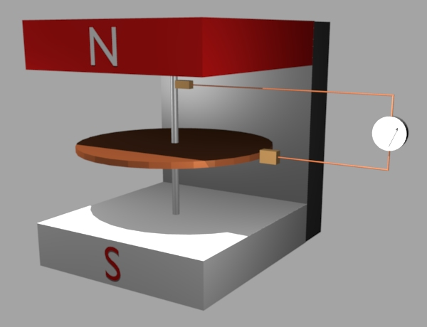
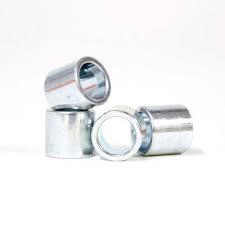
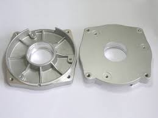

# CH2 - 直流發電機

## 直流發電機之原理

* 弗萊明右手定則(發電機定則) - 判斷感應電勢方向

大拇指(必須先有) - 受力方向: F(機械能、動能)
食指(轉換媒介) - 磁力線方向: B(磁能)
中指(才能產生) - 感應電流方向: I(電能)

* 法拉第實驗 - 放置繞有激磁繞組的磁極於左右兩側，將線圈放在中央(電樞)轉子上，當電樞轉動時，電樞上的導體會不斷的切割磁力線而感應電勢

{width=50%, height=50%}

* 一導體繞成長方形線圈稱為一匝(turn)
* Z(導體數) = 2N(匝數) 
* 線圈邊(Coil side): 
* 繞組(Winding): 由一或多雜的線圈組成
* 並聯電流路徑(a): 將電樞並聯，根據 $P = V I$ ，可降低輸出電壓，而獲得較佳的運轉特性
* 電機角(${\theta}_e$)和機械角(${\theta}_m$)

\begin{equation} \label{eq-e-m}
{\theta}_e = \frac{P}{2} {\theta}_m
\end{equation}

當轉子旋轉時，發電機的導體會感應出一個交流正弦波(Alternate sine wave)的電勢，就是**交流發電機**

\begin{tikzpicture}
\begin{axis}[
    axis lines = left,
    xlabel = \(t\),
    ylabel = {\(v(t)\)},
    mark=*]
\addplot[color=red, domain=0:10, samples=100] {sin(deg(x))};
\end{axis}
\end{tikzpicture}

如果加上換向器(整流子)，則輸出波型為一脈動直流(等於交流正弦波的有效值)，就是**直流發電機**，輸出模型如同橋式整流的輸出波型。

\begin{tikzpicture}
\begin{axis}[]
\addplot[domain=0:10, mark=o, samples=100]{abs(sin(deg(x/2)))};
\end{axis}
\end{tikzpicture}

若裝兩顆繞組，兩繞組相隔 $90^\circ$ 配置

可以表示為

\begin{equation}
\begin{split}
\vec{V_{p1}} = \vec{V_p}
\vec{V_{p2}} = \vec{V_p} + 90^\circ
\end{split}
\end{equation}

\begin{tikzpicture}
\begin{axis}[
    axis lines = left,
    xlabel = \(t\),
    ylabel = {\(v(t)\)}]
\addplot[color=red, dotted, domain=0:10, samples=100] {abs(sin(deg(x)))};
\addplot[color=blue, dashed, domain=0:10, samples=100] {abs(sin(deg(x) - 90))};
\addplot[color=black, thick, domain=0:10, samples=100] {abs(sin(deg(x))) + abs(sin(deg(x) - 90))};
\end{axis}
\end{tikzpicture}

若裝了三個繞組(三項電源)，三個繞組相 $120^\circ$ 配置

可以表示為

\begin{equation}
\begin{split}
\vec{V_{p1}} &= \vec{V_p} \\
\vec{V_{p2}} &= \vec{V_p} + 120^\circ \\
\vec{V_{p3}} &= \vec{V_p} - 120^\circ
\end{split}
\end{equation}

\begin{tikzpicture}
\begin{axis}[
    axis lines = left,
    xlabel = \(t\),
    ylabel = {\(v(t)\)}]
\addplot[color=red, dotted, domain=0:10, samples=100] {abs(sin(deg(x)))};
\addplot[color=blue, dashed, domain=0:10, samples=100] {abs(sin(deg(x) - 120))};
\addplot[color=green, dashed, domain=0:10, samples=100] {abs(sin(deg(x) + 120))};
\addplot[color=black, thick, domain=0:10, samples=100] {
abs(
  sin(deg(x)) +
  sin(deg(x) + 120) +
  sin(deg(x) - 120)
)};
\end{axis}
\end{tikzpicture}

黑色為線電壓，紅、綠、藍為向電壓

* 直流發電機的感應電勢

而每一導體通過一個磁極所需要的時間($\Delta t$) 為

\begin{equation}
\Delta t = \frac{1}{n} \times \frac{1}{P} \times 60 = \frac{60}{nP}
\end{equation}

正負電刷間，每一路徑的串聯匝數(N)為

\begin{equation}
N = \frac{Z_T}{a} = \frac{Z}{2a}
\end{equation}

每一繞組經過一個磁極的磁通變化量為 

\begin{equation}
\Delta \phi = \phi - (- \phi) = 2 \phi
\end{equation}

帶入法拉第電磁感應定律 $E = N \frac{\Delta \phi}{\Delta t}$

\begin{equation} \label{e-motor}
\begin{split}
E &= N \frac{\Delta \phi}{\Delta t} \\
  &= \frac{Z}{2a} \times \frac{2 \phi}{\frac{60}{nP}} \\
  &= \frac{PZ}{60a} \phi n
\end{split}
\end{equation}

$E$: 感應電勢(V)
$n$: 電樞轉速(rpm)
$\phi$: 磁通(Wb)
$Z$: 電樞導體數
$a$: 並聯電流路徑數
$P$: 磁極數

或者當 $P$、$Z$、$a$ 是固定值，假設常數 $K_E = \frac{PZ}{60a}$，則可以寫為

\begin{equation}
E = K_E \phi n
\end{equation}

得知當 $K_E$ 固定時，直流發電機感應電勢和**磁通量**($\phi$) 和**轉速**(n)成正比

### 直流機
  1. 採用矽鋼疊製而成(減少窩損失)
  2. 極掌面大於極心(為提高空氣隙之磁通密度)
  3. 極尖易飽和(輔助換向作用)
  4. 相鄰必為異極

### 繞組

特性       | 分激場繞組 | 串激場繞組   | 中間極場繞組 | 補償繞組
--------   | --------   | --------     | --------     | --------
線徑       | 細         | 粗           | 粗           | 粗
匝數       | 多         | 少           | 少           | 少
電阻       | 大         | 小           | 小           | 小

* 中間極繞組: 裝置於兩主磁極中間改善換向
* 補償繞組: 裝置於主磁極的極面槽內抵銷電樞反應

### 電刷

種類           | 特性               | 接觸電阻   | 用途
-------        | -------            | -------    | -------
炭質電刷       | 質密而堅硬         | 高         | 低速電機
石磨質電刷     | 質軟而潤滑         | 低         | 高速電機
電化石磨質電刷 | 炭精加熱，加壓而成 | 適中       | 一般DC G/M
金屬石磨質電刷 | 含金屬量 50% ~ 90% | 低         | 大電流電機

* 碳: R大幫助換相，增加機械強度
* 石磨: 潤滑作業
* 鋼: 電流大，導電性佳
* 應具備:
  - 高機械強度
  - 高載流容量
  - 高接觸電阻
  - 有潤滑作用

* 握刷器(Brush holder)的功能是將電刷和換向器表面保持穩定的接觸，原理是用彈簧來保持接觸力。壓力必須適中，過大時可能使電刷跳離換向片表面，過小時使電刷跳動，造成換向不良，產生火花

### 轉子

1. 電磁
  1. 矽鋼: 檢少磁滯損
  2. 疊片: 渦流損
  3. 鐵心開口槽 
    - 開口槽(Open slot): 用於大型或轉速較慢之電機
    - 開口槽(Semi-open slot): 用於小型或高速之電機
  4. 鐵心槽架構: 
    斜形槽，使R變化
    =>減少噪音

### 電樞繞組

繞製: 疊繞、波繞

特性           | 疊繞(Lap winding)  | 波繞(Wave winding)
-----          | -----              | -----
串並聯         | 並聯式繞組     | 串聯式繞組
電機特性       | 大電流 低電壓  | 小電流 高電壓
電流路徑數a    | $mP$ m 為複分數，P為極數 | $2 m$ m 為複分數，和極數無關
換相片距 $Y_C$ | $\pm m$ +: 前進，-: 後退  | $\frac{c \pm m}{P / 2}$ +: 前進，-: 後退
兩線圈邊的換向片距 | 等於分數(m)，在相鄰位置 | 相隔「約為」兩個極距
前節距 $Y_F$   | $Y_B - Y_C$    | $Y_C - Y_B$
後節距 $Y_B$   | $int(\frac{S}{P})$ | $int(\frac{S}{P})$
電刷數         | 等於極數       | 等於極數，或只用兩個
虛設線圈       | 無             | 當 $Y_C$ 非整數時可能有
 節省導線的繞法 | 前進繞         | 後退繞

* 疊繞時，若 $Y_B > Y_F$ 為前進繞，否則為後退繞
* 蛙腿繞的優點:
  1. 不用均壓線
  2. 電流路徑多

### 機殼

機殼(Frame)又稱場軛(Field yoke)

功能:

1. 支撐與保護全部機件
2. 當作磁路的一部分

所以機殼必須兼顧1. 高機械強度 2. 導磁能力，小型電機大多以矽鋼或軟鋼板製成，而中大型電機則笧採用鋼板蜷曲成形，再以螺銓釘合而成

### 換向器

* 以雲母做絕緣
* 在直流發電電機中，將電樞繞組產生的交流電轉成直流電
* 在直流電動機中，將外部提供的直流電轉成交流到電樞繞組，以在不同磁極下能產生同一方向的轉距

### 轉軸

轉軸(Shaft)用來支撐電樞繞組及換向器旋轉部分，並藉以傳導機械功率

### 軸承

軸承(Bearing)用以支撐轉軸，使轉子能自由轉動，分為

1. 套管軸承(Sleeve bearing): {width=20%, height=20%}又名滑動軸承，俗稱合銅。小型電機採用青銅為材質的套管軸承，大型則以巴氏合金製成。以潤滑油為媒介體，使轉軸在套管的油膜中旋轉。 
2. 鋼珠軸承(Ball bearing): {width=20%, height=20%} 又名滾珠軸承。結構上分為外環、鋼珠(轉動體)及內環三部分，使用油脂做潤滑劑，普遍用於小型電機
3. 鋼柱軸承(Roller bearing): {width=20%, height=20%}又名滾柱軸承，將鋼珠軸承的鋼珠換成圓柱形的滾棒而已，適用於承受大型負載

### 末端架

末端架(End bracket)又稱端蓋，用以放置軸承，支撐整個電樞轉子的圓形盤狀物。{width=20%, height=20%}

## 直流電激的電樞反應

當發電機接上電負載後，會有電樞電流產生，負載愈大時電樞電流會更著愈大。當電樞電流流過電樞導體時產生電樞磁場(電生磁)，此磁場會干擾主磁極的磁場造成，造成主磁極磁場發生偏移、大小發生變化的現象，這些現象通稱為電樞反應(Armature reaction)。

\begin{tikzpicture}
\draw[dashed, thick] (0, 0) -- (0, 3);
\draw[thick] (0, 0) -- (0, -3);
\node [] at (0, -3.2) {$F_A$};
\draw[red, thick, dotted, thick] (-1, -2.9) -- (1, 2.9);
\draw[thick, ->] (0, 0) -- (3, 0);
\node [] at (3.1, 0.5) {$F_M$};
\draw [red, ->, very thick] (0, 0) -- (2.4, -1);
\draw [dotted] (0, -1) -- (2.4, -1) -- (2.4, 0);
\node [thick, ->] at (2.6, -1) {$F_0$};
\draw [<->] (0.5,0.5) arc (90:-15:20pt);

\node [] at (1.5, 0.4) {$90^\circ$};
\end{tikzpicture}

$F_0$: 合成磁動勢
$F_M$: 主磁極磁動勢
$F_A$: 電樞磁動勢
紅色虛線: 新的磁中性面
y軸: 機械中性面(刷軸)

### 電樞反應的引響

1. 總磁通減少
2. 磁中性面偏移
3. 換向困難

## 電樞磁動勢、去磁和交磁動勢

電樞磁動勢/電樞總安匝($\vec{F_A}$) 由去磁磁動勢/去磁安匝($\vec{F_D}$)(De-magnetizing)及交磁磁動勢/交磁安匝(Cross-magnetizing)($\vec{F_C}$)相加而成

\begin{equation}
\begin{split}
\label{eq-f-a}
\vec{F_A} &= NI \\
          &= \vec{F_D} + \vec{F_C} \\
          &= \frac{Z}{2} \times \frac{I_A}{a}
\end{split}
\end{equation}

或

\begin{equation}
\vec{F_C} = \vec{F_A} - \vec{F_D}
\end{equation}

### 去磁磁動勢 $\vec{F_D}$

每極產生去磁的電樞匝數

\begin{equation}
N_{D/P} = \frac{2a}{360} \times \frac{Z}{2} = \frac{a Z}{360}
\end{equation}

流過去磁區域的電樞導體電流

\begin{equation}
I = \frac{I_A}{a}
\end{equation}

每極的去磁動勢

\begin{equation}
F_{D/P} = N_{D/P} \times I = (\frac{2a}{260} \times \frac{Z}{2}) \times \frac{I_A}{a} = \frac{aZ}{360} \times \frac{I_A}{R_A}
\end{equation}

總去磁動勢

\begin{equation}
F_D = F_{D/P} \times P
\end{equation}

加上方向後變成向量 $\vec{F_D}$

### 交磁磁動勢 $\vec{F_C}$

產生交磁磁動勢的是位於磁極極掌下之電樞導體，其範圍為左右對稱約 $2 \beta$ 的區域，則每極有 $\beta$ 機械角度的電樞導體產生交磁磁動勢

\begin{equation}
\beta = \frac{360}{P} - 2a (\because P(2a + \beta) = 360^\circ)
\end{equation}

流過交磁區域的電樞導體電流

\begin{equation}
I_{C/P}= \frac{I_A}{a}
\end{equation}

每極交磁磁動勢

\begin{equation}
F_{C/P} = N_{C/P} \times I = \frac{\beta Z}{720} \times \frac{I_A}{a}
\end{equation}

總交磁磁動勢

\begin{equation}
F_C = P \times F_{C/P}
\end{equation}

### 去磁動勢占總電樞磁動勢的

\begin{equation}
\label{eq-f-d}
F_D = F_A \times \frac{4 \theta_e}{360} = F_A \times \frac{2\theta_e}{180}
\end{equation}

### 交磁動勢占總電樞磁動勢的

根據公式 \eqref{eq-f-d}

\begin{equation}
F_C = F_A \times \frac{180 - 2 \theta_e}{180}
\end{equation}

或用公式  \eqref{eq-f-a}

\begin{equation}
\vec{F_C} = \vec{F_A} - \vec{F_D}
\end{equation}

### 範例: 台電-電工機械- 108 年試題

> 某**4極**直流發電機，電樞總導體數為144根，繞線方式採**單分疊繞**，其電樞電流為120A，其電刷前移20度電機角，則此發電機之**總去磁安匝**為多少?

答: 480 安匝
解:

1. **電流路徑數** $a = mp = 4 \times 1 = 4$ (疊繞、單分、4極)
2. **電樞總安匝** $F_A$

\begin{equation}
\begin{split}
F_A &= NI \\
    &= \frac{Z}{2} \times \frac{I_A}{a} \\
    &= \frac{144}{2} \times \frac{120}{4} \\
    &= 72 \times 30 \\
    &= 2160 (At)
\end{split}
\end{equation}

3. 根據公式 \eqref{eq-e-m} 得到電機角

\begin{equation}
\theta_e = \frac{P}{2} \times \theta_m = 40^\circ
\end{equation}

4. 用公式 \eqref{eq-f-d} 得到**總去磁安匝**

\begin{equation}
\begin{split}
F_D &= F_A \times \frac{2\theta_e}{180} \\
    &= 2160 \times \frac{40}{180} \\
    &= 480 (At)
\end{split}
\end{equation}

## 改善電樞反應

1. 改良主磁極的結構
  1. 使用削角極尖: 將極掌和電樞面設計為非同心圓，增加極尖的磁阻，如此刻意制電樞反應對極尖的引響
  2. 採用交錯極尖: 以缺左尖和缺右尖的矽鋼片交錯疊成，使極尖的磁路面積降低，磁阻增大，磁通易於飽和，抑制電樞反應。
  3. 採用楞德爾磁極(Lundall pole): 在主磁極的極心刻出長槽，用以增加電樞磁通穿越時的磁阻，抑制電樞反應。
2. 增加主磁極的極數
  在不引響改應電勢或轉矩之下，增加主磁極的極數，相對的可以減少電樞導體數，藉以減少電樞反應引起的磁動勢。
3. 增設補償繞組
  補償繞組勢在主磁極極面內增設繞組，並與電樞繞組組成反向串聯連接。補償繞組的電流方向和電樞繞組相反，用以產生抵銷部分電樞磁動勢，減少電樞反應。
4. 增加中間極(Inter-pole)
  與電樞繞組串聯，發電機用 **NnSS** 的順序，電動機為 **NnSs**。
  可改善電樞反應和改善換向

## 換向曲線

\begin{tikzpicture}
\begin{axis}[domain=-5:5,samples=100,yticklabels=\empty, xticklabels=\empty]
\addplot[blue] {-x};
\addlegendentry{直線換向}
\addplot[red] {sin(deg(x/3)) * -5};
\addlegendentry{正弦波換向}
\addplot[no markers, green, smooth] coordinates {
    (-5, 5)  (-3, 4.2) (5, -5)
};
\addlegendentry{欠速換向}
\addplot[no markers, brown, smooth] coordinates {
    (-5, 5)  (3, -4.2) (5, -5)
};
\addlegendentry{過速換向}
\end{axis}
\end{tikzpicture}

1. 直線換向(電阻性): 最裡想的換向，不會產生火花
2. 正弦波換向: 小火花
3. 欠速換向: 後刷邊產生大火花
4. 過速換向: 前刷邊大火花

## 改善換向作用

1. 裝設補償繞組
2. 裝置中間極(換向磁極)
3. 減少附載的電感量
3. 提高電刷的接觸電阻
4. 移動電刷法(較困難)

## 直流發電機的等效電路

\begin{tikzpicture}
[
   level distance=18mm,
   every node/.style={fill=red!50,inner sep=5pt},
   level 1/.style={sibling distance=30mm,nodes={fill=yellow!45}},
   level 2/.style={sibling distance=15mm,nodes={fill=red!20}},
   level 3/.style={sibling distance=35mm,nodes={fill=blue!30}},
   level 4/.style={sibling distance=20mm,nodes={fill=green!20}}
]
\tikzstyle{every node}=[font=\small]
  \node[draw] {直流發電機}
    child {node[draw] {他(外)激式}}
    child {node[draw] {自激式} 
                child {node[draw] {他激式}}
                child {node[draw] {串激式}}
                child {node[draw] {分激式}}
                child {node[draw] {複激式}
            child {node[draw] {依連接方式}
                    child {node[draw] {長並聯式}}
                child {node[draw] {短並聯式}}
            }
                    child {node[draw] {依磁通方向}
                child {node[draw] {激複激式}}
                child {node[draw] {差複激式}}
            }
           }
       }
        ;
\end{tikzpicture}

依照 KVL 和 KCL 來分析

### 他(外)激式

\begin{circuitikz}
\draw (0, 0)
  to [open, v=$V_F$] (0, 3)
  to [short, i=$I_F$] (1.5, 3);
\draw (0, 0)
  to [short] (1.5, 0)
  to [inductor=$R_F$, cute] (1.5, 3);

\node[elmech] at (2.5, 1.5) (M) {G};
\node[elmech] at (2.5, 1.5) (M) {G};
\node[] at (3.5, 1.5) {$I_A R_A$};
\draw[] (M.north) 
  to [short](2.5, 3)
  to [short, i=$I_L$](5, 3)
  to [R=$R_L$](5, 0)
  to [short] (2.5, 0)
  to [short] (M.south);
\draw (4.5, 0)
  to [open, v<=$V_L$, o-o](4.5, 3);
\end{circuitikz}

\begin{equation}
\begin{split}
&V_L = E_A - I_A R_A - V_B \\
&I_F = \frac{V_F}{R_F} \\
&I_L = \frac{V_L}{R_L} \\
&I_A = I_L
\end{split}
\end{equation}

### 分(並)激式

\begin{circuitikz}
\draw (2.5, 0)
  to [short] (1.5, 0)
  to [inductor=$R_F$, cute] (1.5, 3)
  to [short](2.5, 3);
\node[elmech] at (2.5, 1.5) (M) {G};
\node[] at (3.5, 1.5) {$I_A R_A$};
\node[] at (3, 2.4) {$V_B$};
\draw[] (M.north) 
  to [short](2.5, 3)
  to [short, i=$I_L$, *-](5, 3)
  to [R=$R_L$](5, 0)
  to [short, -*] (2.5, 0)
  to [short] (M.south);
\draw (4.5, 0)
  to [open, v<=$V_L$, o-o](4.5, 3);
\end{circuitikz}

\begin{equation}
\begin{split}
V_L &= E_A - I_A R_A - V_B \\
I_A &= I_F + I_L \\
I_F &= \frac{V_L}{R_F} \\
I_L &= \frac{V_L}{R_L}
\end{split}
\end{equation}

### 串激式

\begin{circuitikz}
\node[elmech] at (2.5, 1.5) (M) {G};
\node[] at (3.5, 1.5) {$I_A R_A$};
\node[] at (3, 2.4) {$V_B$};
\draw[] (M.north) 
  to [short](2.5, 3)
  to [short, i=$I_L$, *-](5, 3)
  to [R=$R_L$](5, 0)
  to [inductor=$R_S$, cute, -*, i=$I_F$] (2.5, 0)
  to [short, i=$I_A$] (M.south);
\draw (4.5, 0)
  to [open, v<=$V_L$, o-o](4.5, 3);
\end{circuitikz}

\begin{equation}
\begin{split}
V_L &= E_A - I_A(R_A + R_S) - V_B \\
I_A &= I_F = I_L = \frac{V_L}{R_L}
\end{split}
\end{equation}

### 短並聯複激式

\begin{circuitikz}
\node[elmech] at (2.5, 1.5) (M) {G};
\node[] at (3.5, 1.5) {$I_A R_A$};
\node[] at (3, 2.4) {$V_B$};
\draw (2.5, 0)
  to [short] (1.5, 0)
  to [inductor=$R_F$, cute, i=$I_F$] (1.5, 3)
  to [short](2.5, 3);
\draw (0.5, 0)
  to[open, v<=$V_F$] (0.5, 3);
\draw[] (M.north) 
  to [short](2.5, 3)
  to [short, i=$I_L$, *-](5, 3)
  to [R=$R_L$](5, 0)
  to [inductor=$R_S$, cute, -*, i=$I_F$] (2.5, 0)
  to [short, i=$I_A$] (M.south);
\draw (4.5, 0)
  to [open, v<=$V_L$, o-o](4.5, 3);
\end{circuitikz}

\begin{equation}
\begin{split}
V_L &= E_A - I_A R_A - V_B - I_S R_S = V_F - I_S R_S \\
I_S &= I_L \\
I_F &= \frac{V_F}{R_F} \\
I_L &= \frac{V_L}{R_L} \\
I_A &= I_F + I_L  = I_F + I_S
\end{split}
\end{equation}

### 長並聯複激式

\begin{circuitikz}
\node[elmech] at (1.2, 1.5) (M) {G};
\node[] at (0.7, 2) {$I_A R_A$};
\node[] at (0.5, 1.2) {$V_B$};
\draw (3, 0)
  to [short] (3, 0)
  to [inductor=$R_F$, cute, i<=$I_S$] (3, 3)
  to [short](2.5, 3);

\draw[] (M.north) 
  to [short](1.2, 3)

  to [short](5, 3)
  to [R=$R_L$, i=$I_L$](5, 0)  
  to [short] (3, 0)
  to [inductor=$R_S$, cute, i=$I_F$, -*] (1.2, 0)
  to [short, i=$I_A$] (M.south);
\draw (4.5, 0)
  to [open, v<=$V_L$, o-o](4.5, 3);
\end{circuitikz}

\begin{equation}
\begin{split}
V_L &= E_A - I_A R_A - V_B - I_S R_S = V_F \\
I_S &= I_A \\
I_F &= \frac{V_F}{R_F} \\
I_L &= \frac{V_L}{R_L} \\
I_A &= I_F + I_L  = I_F + I_S
\end{split}
\end{equation}

## 直流發電機的特性曲線

曲線名稱           | x軸   | Y軸   | 固定條件(控制變數)      | 調整項目(自變數)
----               | ----  | ----  | ----                    | ----
無載(磁化)特性曲線 | $I_F$ | $E_A$ | 無負載、轉速(n)         | 磁場電流 $I_F$
負載(外部)特性曲線 | $I_L$ | $V_L$ | 轉速(n)、磁場電流 $I_F$ | 負載電流 $I_L$
內部特性曲線       | $I_A$ | $E_A$ | 轉速(n)、磁場電流 $I_F$ | 負載電流 $I_L$
電樞特性曲線       | $I_F$ | $I_A$ | 轉速(n)、端電壓 $V_L$   | 負載電流 $I_L$

無載特性曲線繪出的曲線稱為無載飽和曲線

### 他(外)式發電機的特性曲線

* 無載特性曲線: 與鐵心的磁化曲線相似
* 外部特性曲線: 端電壓 $V_L$ 隨著負載電流 $I_L$ 增加減少

\begin{tikzpicture}
\draw[blue, densely dashed] (0, 3) --(4, 3);
\draw[thick, red] (0, 3) .. controls (2.7,2.8) and (2.7, 2.8).. (4,2.5);
\draw[] (0, 5) -- (0, 0) -- (5, 0);
\node[] at (-0.5, 3) {$E$};
\node[] at (3, -0.5) {$I_L$};
\end{tikzpicture}

* 他激式的特性
  - 激磁電流獨立供電，不受電樞及負載引響
  - 改變激磁電流 $I_F$ 的極性可以控制 $\phi_F$ 方向，改變感應電勢 $E$ 的極性
  - 輸出電壓變動小，可視為定電壓的直流發電機
  - 用途: 當作激磁機、華德黎翁納德系統等需要穩定電壓的直流源

### 分(並)機式發電機的特性曲線

* 電壓建立過程

\begin{tikzpicture}
\begin{axis}[
    domain=0:100,
    axis lines = left,
    xlabel = {激磁電流$I_F$},
    ylabel = {感應電勢$E$},
    xticklabels={$I_1$, $I_2$, $I_3$, $I_4$, $I_5$, $I_6$, $I_7$, $I_8$, $I_9$}, 
    xtick={0, 5, 10, 15, 27, 45, 60, 70, 79, 84, 89},
    yticklabels={$E_1$, $E_2$, $E_3$, $E_4$, $E_5$, $E_6$, $E_7$, $E_8$, $E_9$},
    ytick={0, 5, 10, 15, 27, 45, 60, 70, 79, 84, 89},
    width=13cm,
    height=10cm
]
\addplot[color=green] {0.5*x};
\addlegendentry{$R_{F1}$ (大)}
\addplot[color=yellow] {0.7*x};
\addlegendentry{$R_{F2}$ (中)}
\addplot[color=blue] {0.9*x};
\addlegendentry{$R_{F3}$ (小)}
\addplot[color=red, thick] {0.7*x+sin(deg(x/60))*20 - (x/17)^2};
\addlegendentry{無載飽和曲線}
\end{axis}
\node[draw, rounded corners=10pt, align=center] at (9, 2)
{
  電壓建立的順序: \\
  $ E_1 \rightarrow E_1 \rightarrow I_1 \rightarrow E_2 \rightarrow I_2 \rightarrow E_3 \rightarrow I_3 $ \\ 
  $ \rightarrow E_4 \rightarrow I_4 \rightarrow E_5 \rightarrow I_5 \rightarrow E_6 \rightarrow I_6 $ \\ $  \rightarrow E_7 \rightarrow I_7 \rightarrow E_8
    \rightarrow I_8 \rightarrow E_9 \rightarrow I_9$
};
\end{tikzpicture}

* 發電機電壓建立過程:
  1. 發電機靜止時，無感應電勢
  2. 以原動機驅動，使發電機旋轉，並維持而定轉速n
  3. 電樞導體切割剩磁磁通 $\phi_R$，產生小小感應電勢 $E = E_1 = K \phi_R n$
  4. 更具圖中場電阻線 $R_{F2}$ ， $E_1$ 產生對應的場電流， $I_F = I_1$
  5. $I_1$ 流過磁場繞組，產生磁通 $\phi_1$，此 $\phi_1$ 和 $\phi_R$ 方向相同，$E = E_2 = K(\phi_R + \phi_2)$ ，總體 $\phi$ 上升，感應電勢更著上升
  6. 此一 $E2$，使機磁電流上升，$I_F = I_2$
  7. 重複步驟 5、6，更高的 $I_F$ 產生更高的 E，由 $E_3 \rightarrow I_3 \rightarrow E_4 \cdots \rightarrow I_9 \rightarrow E_9$
  8. 直到磁化曲線和場電組線之交叉點Q時，由於磁通飽和效應，磁通不再增加，感應電勢不再增加，$E = E_9$，而趨於穩定

有兩個因素會引響感應電勢高低

1. 電樞轉速: $E = K \phi n$，感應電勢和轉速成正比
2. 磁場電阻: $R_F$ 愈小，$I_F$ 愈大，產生磁通 $\phi$ 愈多，感應電勢$E$愈高，感應電勢與 $R_F$ 成反比。

當轉速愈低或磁場電阻愈大，將使感應電勢降低，當達到某個點時，將使電樞無法感應電勢，有兩個名詞來描述電阻和轉速臨界值。

* 臨界場電阻(Critical field resistance): 固定轉速下，能使電動機感應電勢的最大磁場電阻
* 臨界轉速(Critical speed): 固定場電阻下，能使電動機感應電勢的最低轉速

* 外部特性曲線: 

- 負載電流 $I_L$ 有先升後降的特性: 當負載持續增加時，負載電阻 $R_L$ 下降、負載電流 $I_L$ 上升、與之並聯的 $I_F$ 因於下降($I_A = I_F + I_L$)、所產升磁通減少、感應電勢 $E$ 下降，連鎖反應的結果是出現**崩潰點**(Break-down point)，造成 $V_L$ 急劇下降為零，同時 $I_L$ 因而下降。
- 具有短路自我保護的特性: 當輸出短路時，使 $V_L = 0$，則 $V_F = 0$，$I_F = 0$，不會產升磁通，只有剩磁，使 $I_L$ 自動下降，使負載不會燒毀。
- 用途: 一般直流電源、蓄電磁用發電機、交流發電機之機磁機。

* 負載增加: 當並聯愈多負載，因 $R_L = R_{L1} \mathbin{\!/\mkern-5mu/\!} R_{L2}$ 而使負載總電阻減少，而負載電流因 $I = \frac{V}{R}$ 並聯而愈多，功率愈大 ($P = \frac{V^2}{R}$)
* 臨界磁場電阻 $R_Fc$：能建立電壓的最大廠電阻，即為與無載飽和曲線相切之場電阻線。
* 臨界轉速$N_c$：能建立電壓的最低轉速，即為與場電阻線相切之轉速。
* 電機建立電壓的條件:
  1. 須有剩磁。
  2. 剩磁與場磁通的方向要一致。
  3. 磁場電阻 $R_F$ 須小於臨界磁場電阻 $R_Fc$
  4. 轉速N須大於臨界轉速 $N_c$

\begin{tikzpicture}
\draw[blue, densely dashed] (0, 3) --(4, 3);
\draw[thick, red] (0, 3) .. controls (3.5,2.5) and (3.5, 2.5).. (2,0);
\draw[] (0, 5) -- (0, 0) -- (5, 0);
\node[] at (-0.5, 3) {$V_L$};
\node[] at (3, -0.5) {$I_L$};
\end{tikzpicture}

### 串激式發電機的特性曲線

* 無載特性曲線: 串激式發電機在無載時，因與負載串聯，所以呈現斷路，$I_F = I_A = I_L = 0$，沒有無載特性曲線
* 外部特性曲線: 

接上負載後，$I_A$、$I_L$、$I_F$ 增加，主磁極磁通增加，感應電勢 $E$ 增加，輸出端電壓 $V_L$ 隨著負載電流 $I_L$ 增加而上升，為原點到 $o$ 點，適合做 **升壓機** (Blooster)

過了 $a$ 後，因磁飽和現象，磁通不再增加，因電樞反應的去磁動勢甚大，使 $V_L$ 急速下降為零，而 $I_L$ 可視為定值，下降具有恆流效果，可作為弧光燈之電源。

\begin{tikzpicture}
\draw[thick, red] (0,0) .. controls (2.7,5) and (4, 4.9).. (4,0);
\draw[fill=black] (3, 3.7) circle (2pt); 
\node[] at (3, 4) {a};
\draw[] (0, 5) -- (0, 0) -- (5, 0);
\node[] at (-0.5, 3) {$V_L$};
\node[] at (3, -0.5) {$I_L$};
\end{tikzpicture}

### 複激式發電機的特性曲線

* 積(和)複激式: $\phi_S$ 和 $\phi_F$ 的方向**相同**

\begin{equation}
\phi_T = \phi_F + \phi_S
\end{equation}

* 差複激式: $\phi_S$ 和 $\phi_F$ 的方向**相反**

\begin{equation}
\phi_T = \phi_F - \phi_S
\end{equation}

* 分激場繞組產升的 $\phi_F$ 為主要磁通，串激場繞組產生的 $\phi_S$ 用於補償電樞電阻及電樞反應產生的壓降，以維持輸出電壓的穩定。所以串激場繞組與複載串聯，磁通 $\phi_S$ 大小隨附載電流 $I_L$ 而變動，且其值小於分激場磁通 $\phi_F$。串激場繞組採用粗而少的導線繞製而成

藉由在串激場繞組上並聯分流電阻器 $R_X$，調整 $R_X$ 的大小，藉著**串激場繞組產生的感應電勢**和**電樞電阻及電樞反應產生的壓降**比較可分為

類型    | $V_S$ | $V_FL$ 和 $V_NL$ 比較 | 電壓調整率 $\mathcal {E}$
---     | ---   | ---                   | ---
過複激  | 大    | $V_{FL} > V_{NL}$    | 小於零(負值)
平複激  | 中    | $V_{FL} = V_{NL}$    | 零
欠複激  | 小    | $V_{FL} < V_{NL}$    | 大於零(正值)

\begin{tikzpicture}
\draw (0, 0) -- (0, 5);
\draw (0, 0) -- (5, 0);
\draw[thick, red] (0, 4) .. controls (3, 4.8) and (3, 4.8) .. (5, 5);
\draw [dotted, gray] (3.2, 0) -- (3.2, 5);
\draw [dotted, gray] (0, 4) -- (5, 4);
\draw[thick, blue] (0, 4) .. controls (2.4, 4.3) and (2.4, 4.3) .. (5, 3.4);
\draw[thick, green] (0, 4) .. controls (3, 3.7) and (3, 3.7) .. (5, 3);
\draw[thick, magenta] (0, 4) .. controls (3, 3) and (3, 3) .. (5, 2);
\draw[thick, yellow] (0, 4) .. controls (3, 2.5) and (3, 2.5) .. (4, 1);
\draw[thick, cyan] (0, 0) .. controls (4, 5) and (4, 5) .. (5, 3);
\node[red] at (4, 0.4) {過複激};
\node[blue] at (4, 0.8) {平複激};
\node[green] at (4, 1.2) {欠複激};
\node[magenta] at (4, 1.6) {分激};
\node[yellow] at (4, 2) {差複激};
\node[cyan] at (4, 2.4) {串激};
\end{tikzpicture}

* 紅色: 過複激
* 深藍色: 平複激
* 綠色: 欠複激
* 紫色: 分激
* 黃色: 差複激
* 淺藍色: 串激

* 複激式發電機的用途:

類型        | 用途
---------   | ---------
過複激式    | 礦坑或電車
平復激式    | 一般直流電源或中小型直流激用激磁機
欠複激式    | 
差複激式    | 

## 電壓調整率

\begin{equation}
\label{eq-vr}
\mathcal {E} \% = VR \% = \frac{V_{NL} - V_{FL}}{V_FL} \times 100\%
\end{equation}

* 電壓調整率為正: $V_{FL} > F_{NL}$ 如他激、分激，欠複激式、差複激式
* 電壓調整率為負: 如平複激式
* 電壓調整率為零: $V_{FL} < V_{NL}$ 如串複激式、過複激式

## 直流發電機的並聯運用

優點:

1. 提高運轉效率
2. 突破單機容量限制
3. 增加供電穩定性
4. 減少備用發電機容量 

條件:

1. 額定端電壓需相等，極性須相同
2. 具備相同的外部(負載)特性
3. 如果是過複激式，需加裝均壓線

電壓關係式

\begin{equation}
V_L = V_1 = V_2
\end{equation}

## 直流電機(發電機、電動機的耗損)及效率

\begin{tikzpicture}[scale=0.8]
\tikzset{edge from parent/.style=
{draw,
edge from parent path={(\tikzparentnode.south)
-- +(0,-8pt)
-| (\tikzchildnode)}}}
\Tree [.直流電動機損失
    [.選轉損 [
      [.機械損 [
        [.軸承摩擦損 ]
        [.電刷摩擦損 ]
        [.風阻損 ]
        [.其他 ]
      ] ]
      [.鐵損 [
          [.磁滯損 ]
          [.渦流損 ]
      ] 
      ]
    ] ]
    [.銅損 [
         [.電樞銅損 ]
         [.分激場銅損 ]
         [.串激場銅損 ]
         [.電刷接觸損失 ]
         [.中間極銅損 ]
         [.補償繞組銅損 ]
    ]
    ]
    [.雜散負載損 ]
]

\end{tikzpicture}

### 機械損失

有軸承摩擦損、電刷摩擦損、風阻損等，可由實驗得之。

### 鐵損(Core-loss)

1. 磁滯損

鐵心磁分子互相摩擦，因磁滯現象所引起的損失。

\begin{equation}
P_H \propto {B_M}^x f G
\end{equation}

* $G$: 鐵心重量
* $B_M$: 最大磁通密度
* $f$: 頻率
* $X$: 鐵心材料常數，通常假設為2

2. 渦流損

渦流(eddy current)在鐵心引起的損失

\begin{equation}
P_E \propto B_{M}^2 f^2 G t^2
\end{equation}

* 鐵心採用絕緣薄鋼片疊成，可以減少渦流損
* 磁滯損和頻率成正比，渦流損頻率平方成正比
* 頻率是指電樞電流的交流頻率，和轉速成正比

### 銅損

根據

\begin{equation*}
P = I ^ 2 R
\end{equation*}

該繞組的銅損和流過該繞組的電流成平方正比，除了**分激、他激場繞組銅損**較不受影響外(視為固定值)，**電樞繞組銅損**和電樞電流成平方正比，其他皆視為和**負載電流成平方正比**。

### 雜散負載損

由負載電流引起，無法分別或計算其值，一般而言，雜散負載損以滿載輸出的 $1 \%$ 計算

* 固定損: 鐵損、機械損、分激場繞組銅損、他激場繞組銅損
* 變動損: 旋轉損、其他銅損

## 直流發電機的效率

定義效率(Efficiency)為

\begin{equation}
\text{效率} \eta = \frac{\text{輸入功率}}{\text{輸出功率}} = \frac{P_o}{P_i} = \frac{P_o}{P_o + P_{loss}} \times 100 \%
\end{equation}

在直流發電機、電動機或變壓器裡也可以寫成

\begin{equation} \begin{split}
\text{效率} \eta &= \frac{\text{輸出功率}}{\text{輸入功率}} \times 100 \% \\
                 &=\frac{V_2 I_2 \cos \theta_2}{V_2 I_2 + P_I + P_C} (\text{變壓器}) \times 100 \%
\end{split} \end{equation}

## 直流發電機的功率轉換

\begin{tikzpicture}[every text node part/.style={align=center}]
\foreach \i / \c in {4/green!20, 3/cyan!20, 2/gray!20, 1/magenta!20} {
  \draw[fill=\c] (0, 0) arc (0:360:\i);
}
\node[] at (-1, 0) {輸出功率 \\ $P_o = V_L I_L$ };
\node[] at (-3, 0) {電樞端功率 \\ $P_A = V_A I_A$};
\node[] at (-5, 0) {電磁功率  \\ $P_m = E_A I_A$ };
\node[] at (-7, 0) {原電動機 \\ 輸入電功率  \\ $P_M = P_I = \omega T$};
\draw [-stealth] (-1, -1) -- ++(2, -2) node[below] {分激場銅損  $P_{RF} = I_F^2 R_F$ + \\ 串激場銅損 $P_{RS} = I_S^2 R_S$ };
\draw [-stealth] (-2, 2) -- ++(1, 1) node[right] {電刷接觸損失 $P_B = V_B I_A$ + \\  電樞銅損 $P_{RA} = I_A^2R_A$};
\draw [-stealth] (-6, 0) -- ++(-1, -4) node[below] {無載旋轉損失 $P_{NL}$  + 雜散負載損失 $P_{stray}$};
\end{tikzpicture}

\begin{equation}
\begin{split}
& \text{輸入機械功率} - (\text{無載旋轉損失} + \text{雜散負載損}) = \text{電磁功率} \\
& P_M - (P_{NL} + P_{stray}) = P_m = E_A I_A
\end{split}
\end{equation}

\begin{equation}
\begin{split}
\text{電磁功率} - (\text{電樞銅損} + \text{電刷接觸損}) = \text{電樞端電功率}
P_m - (P_{RA} + P_B) = P_A = V_A I_A
\end{split}
\end{equation}

\begin{equation}
\begin{split}
\text{電樞端電功率} - (\text{串激場磁通損失} + \text{分激場磁通損失}) = \text{輸出電功率}
P_A - (P_{RS} + P_{RF}) = P_o = E_A I_L
\end{split}
\end{equation}

全日效率

\begin{equation}
\text{全日效率} = \frac{\text{全日輸出總能量}}{\text{全日輸入總能量} + \text{全日固定損失} + \text{全日變動損失}} \times 100 \%
\end{equation}

電機絕緣等級(class of insulation) [Insulation system](https://www.wikiwand.com/en/Insulation_system)

絕緣等級     | 容許最高溫度 | 構成絕緣的材料
--------     | --------     | --------
Y            | 90           | 棉紗、絲、紙等構成,但未浸過清漆(凡立水varnish)類,或未浸於絕緣油中。或未浸入油中。
A            | 105          | 棉紗、絲、紙等構成,並經滲透清漆類,或浸於絕緣油中。
E            | 120          | 係能充分耐受容許最高溫度 $120^\circ$ 的材料所構成的絕緣,如 mylar。
B            | 130          | 例如雲母、石棉、玻璃纖維等材料，藉適當的黏合劑所構成的絕緣。
F            | 155          | 例如雲母、石棉、玻璃纖維等材,藉矽化烴樹脂(silicon alkyd resin) 等黏合劑所構成的絕緣。
H            | 180          | 例如雲母、石棉、玻璃纖維等材料藉矽樹脂(silicon resin)或具有同等特 性之黏合劑才以構成的材料,此外將膠狀及固態狀矽樹脂或具有同等特性的材料單獨使用者亦包括在內。
C            | 180以上      | 將生雲母、石棉、瓷等單獨使用而構成者,或藉黏合劑才以構成者。

